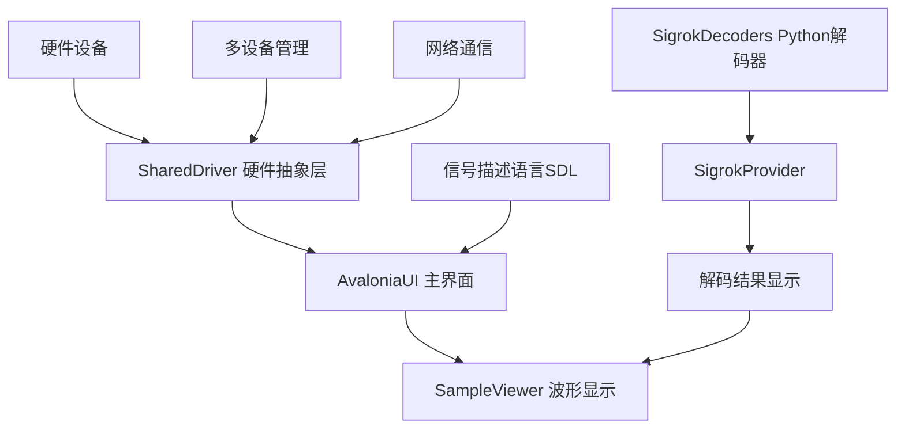
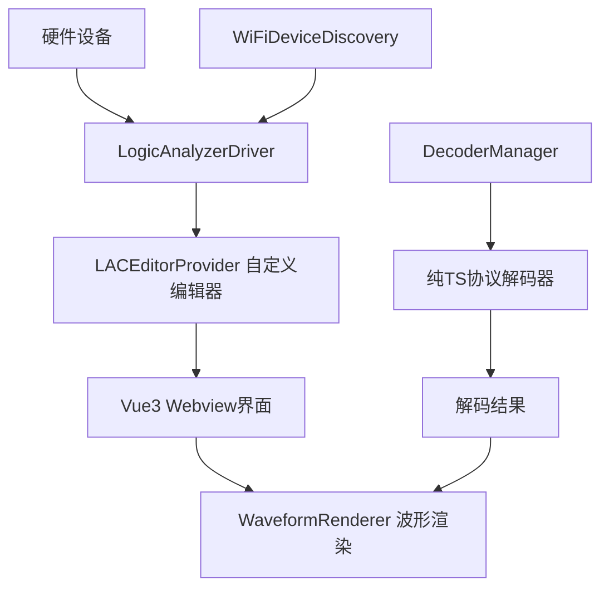
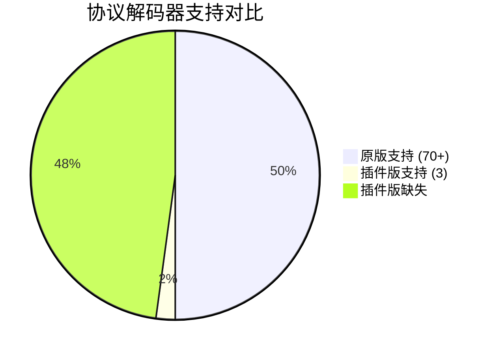
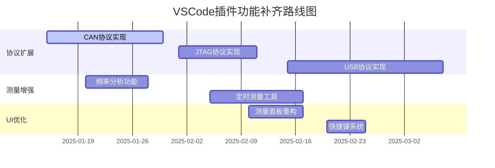

# VSCode 插件与原版逻辑分析仪功能对比分析

> **文档版本**: 1.0
> **创建时间**: 2025-08-15
> **分析范围**: VSCode插件版 (@src) vs 原版C#实现 (@logicanalyzer)

---

## 📋 执行摘要

### 项目概述

本文档深入分析了两个版本的逻辑分析仪实现的功能对比：

1. **原版逻辑分析仪 (LogicAnalyzer)** - 基于 C#/.NET 8 和 AvaloniaUI 的完整桌面应用解决方案
2. **VSCode 插件版** - 基于 TypeScript 和 Vue3 的 VSCode 扩展实现

### 关键发现总览

| 对比维度 | 原版逻辑分析仪 | VSCode插件版 | 差异程度 |
|---------|--------------|-------------|---------|
| **功能完整性** | ✅ 完整 (100%) | ⚠️ 基础 (60%) | **中等差距** |
| **协议支持** | ✅ 70+ 协议 | ⚠️ 3个基础协议 | **显著差距** |
| **硬件支持** | ✅ 全面支持 | ✅ 核心支持 | **轻微差距** |
| **用户界面** | ✅ 成熟桌面UI | ✅ 现代Web UI | **实现方式不同** |
| **部署复杂度** | ⚠️ 独立应用 | ✅ VSCode集成 | **各有优劣** |

### 核心差异点

#### ✅ VSCode插件版的优势
- **集成开发环境**: 无缝集成到VSCode开发工作流
- **现代化UI**: Vue3 + Element Plus 现代化界面
- **轻量部署**: 无需独立安装，依托VSCode生态
- **跨平台一致性**: VSCode环境下表现一致

#### ⚠️ VSCode插件版的不足
- **协议支持有限**: 仅支持I2C、SPI、UART三种基础协议
- **缺少高级功能**: 无WiFi支持、多设备级联、突发模式等
- **性能限制**: 依赖VSCode环境，存在性能开销
- **功能深度不足**: 缺少信号描述语言、测量工具等高级特性

---

## 🏗️ 架构对比分析

### 技术栈对比

| 技术层面 | 原版逻辑分析仪 | VSCode插件版 | 架构影响 |
|---------|---------------|-------------|---------|
| **开发语言** | C# (.NET 8) | TypeScript (ES2020) | 性能vs开发效率 |
| **UI框架** | AvaloniaUI 11.2.3 | Vue 3 + Element Plus | 桌面vs Web体验 |
| **协议解码** | Sigrok + pythonnet | 纯TypeScript实现 | 功能完整性vs维护性 |
| **数据处理** | 不安全代码优化 | V8引擎原生执行 | 高性能vs跨平台 |
| **部署方式** | 独立可执行文件 | VSCode扩展 | 独立性vs集成性 |

### 系统架构对比

#### 原版架构


#### VSCode插件架构


---

## 📊 详细功能对比表

### 核心功能模块

| 功能模块 | 功能项 | 原版实现 | VSCode插件版 | 实现状态 | 差异说明 |
|---------|--------|---------|-------------|----------|----------|
| **硬件通信** | USB串口连接 | ✅ 完整 | ✅ 完整 | 相同 | 都基于SerialPort实现 |
|  | 网络TCP连接 | ✅ 完整 | ✅ 完整 | 相同 | Socket通信协议一致 |
|  | 设备自动检测 | ✅ 完整 | ✅ 基础 | 部分实现 | 插件版缺少复杂检测逻辑 |
|  | WiFi设备发现 | ✅ 完整 | ⚠️ 基础 | 功能简化 | 缺少广播发现等高级功能 |
| **数据采集** | 简单触发 | ✅ 完整 | ✅ 完整 | 相同 | 都支持边沿触发 |
|  | 复杂触发 | ✅ 完整 | ✅ 完整 | 相同 | 都支持模式匹配 |
|  | 快速触发 | ✅ 完整 | ✅ 完整 | 相同 | 都支持5位模式 |
|  | 突发模式 | ✅ 完整 | ❌ 未实现 | 缺失 | 插件版不支持多次触发 |
|  | 24通道采集 | ✅ 完整 | ✅ 完整 | 相同 | 都支持最大24通道 |
| **波形显示** | 实时渲染 | ✅ 成熟 | ✅ 基础 | 实现方式不同 | 原版用Canvas2D，插件版用WebGL |
|  | 缩放平移 | ✅ 完整 | ✅ 完整 | 相同 | 都支持鼠标操作 |
|  | 标记测量 | ✅ 丰富 | ✅ 基础 | 功能差异 | 原版测量功能更强大 |
|  | 区域选择 | ✅ 完整 | ✅ 基础 | 实现不同 | 原版支持多区域管理 |
| **协议解码** | 基础协议 | ✅ 70+种 | ⚠️ 3种 | 显著差异 | 原版集成Sigrok完整库 |
|  | 自定义协议 | ✅ Python扩展 | ⚠️ TS扩展 | 实现方式不同 | 插件版扩展机制简单 |
|  | 实时解码 | ✅ 完整 | ✅ 基础 | 实现不同 | 性能和功能有差异 |
| **数据导出** | 格式支持 | ✅ 8+格式 | ✅ 6+格式 | 基本相同 | 都支持主流格式 |
|  | Sigrok兼容 | ✅ 完整 | ✅ 基础 | 兼容性差异 | 插件版兼容性有限 |

---

## ✅ 相同功能实现分析

### 硬件驱动层
两个版本都实现了完整的硬件抽象层，支持：

#### 通信协议
```typescript
// 两个版本都实现了相同的数据帧格式
interface OutputPacket {
  startMarker: 0x55AA;        // 起始标记
  command: number;            // 命令字节
  payload: Uint8Array;        // 数据载荷
  endMarker: 0xAA55;         // 结束标记
}
```

#### 设备连接管理
- **串口连接**: 都使用115200波特率
- **网络连接**: 都支持TCP Socket通信
- **设备识别**: 都通过版本查询命令验证设备

#### 采集参数配置
```typescript
interface CaptureSession {
  frequency: number;           // 采样频率 (3.1KHz - 100MHz)
  preTriggerSamples: number;   // 触发前样本数
  postTriggerSamples: number;  // 触发后样本数
  triggerType: TriggerType;    // 触发类型
  // ... 其他参数完全一致
}
```

### 数据处理流程
两个版本采用相同的数据处理流水线：

1. **硬件采集** → 2. **协议封装** → 3. **数据传输** → 4. **解析渲染**

---

## ⚠️ 差异功能和实现方式

### 协议解码器实现

#### 原版 - Sigrok集成方案
```csharp
// 基于pythonnet的Python解码器集成
public class SigrokProvider {
    private PythonEngine pythonEngine;
    private Assembly dynamicAssembly;

    // 动态加载70+种Python解码器
    public void LoadDecoders() {
        var decoderFiles = Directory.GetFiles("decoders", "*.py");
        foreach(var file in decoderFiles) {
            var decoder = pythonEngine.LoadDecoder(file);
            RegisterDecoder(decoder);
        }
    }
}
```

#### VSCode插件版 - 纯TypeScript方案
```typescript
// 纯TypeScript实现，零Python依赖
export abstract class DecoderBase {
  abstract readonly id: string;
  abstract readonly name: string;

  // 主解码方法 - 纯TS实现
  abstract decode(
    sampleRate: number,
    channels: ChannelData[],
    options: DecoderOptionValue[]
  ): DecoderResult[];
}

// 目前仅实现3种基础协议
// I2CDecoder, SPIDecoder, UARTDecoder
```

### 用户界面架构

#### 原版 - MVVM桌面应用
```xml
<!-- AvaloniaUI XAML界面 -->
<Window>
  <DockPanel>
    <Menu DockPanel.Dock="Top">
      <MenuItem Header="文件"/>
      <MenuItem Header="设备"/>
      <MenuItem Header="协议"/>
    </Menu>
    <StatusBar DockPanel.Dock="Bottom"/>
    <Grid>
      <SampleViewer/>
      <ChannelViewer/>
    </Grid>
  </DockPanel>
</Window>
```

#### VSCode插件版 - Vue组件化
```vue
<!-- Vue3 + Element Plus界面 -->
<template>
  <div class="analyzer-container">
    <el-tabs v-model="activeTab">
      <el-tab-pane label="解码器" name="decoder">
        <DecoderPanel ref="decoderPanelRef"/>
      </el-tab-pane>
      <el-tab-pane label="测量" name="measurement">
        <MeasurementTools/>
      </el-tab-pane>
    </el-tabs>
    <WaveformRenderer ref="waveformCanvas"/>
  </div>
</template>
```

---

## ❌ 未实现功能清单

### 高级硬件功能

#### 1. 多设备级联 (Multi-Device Chaining)
- **原版功能**: 支持最多5个设备级联，实现120通道采集
- **实现状态**: VSCode插件版完全未实现
- **技术差距**: 需要实现设备同步、时钟级联、数据合并等复杂功能

#### 2. WiFi高级功能
- **原版功能**: WiFi设备配置、网络诊断、自动重连
- **插件版现状**: 仅有基础WiFi设备发现
- **缺失功能**:
  - WiFi网络配置界面
  - 网络稳定性监控
  - 广播设备发现
  - 连接故障诊断

#### 3. 突发模式 (Burst Mode)
```csharp
// 原版支持的突发模式配置
public class BurstModeConfig {
    public int LoopCount { get; set; }      // 突发次数
    public bool MeasureBursts { get; set; } // 测量突发间隔
    public uint BurstPreSamples { get; set; }
    public uint BurstPostSamples { get; set; }
}
```
- **插件版现状**: 完全未实现，仅支持单次触发

### 协议解码功能

#### 1. 高级协议支持
原版支持但插件版缺失的协议类别：

| 协议类别 | 原版支持数量 | 插件版支持 | 缺失协议示例 |
|---------|-------------|-----------|-------------|
| **工业总线** | 15+ | 0 | CAN, LIN, Modbus, JTAG |
| **存储协议** | 10+ | 0 | SD Card, EEPROM, SPI Flash |
| **网络协议** | 8+ | 0 | USB, Ethernet, WiFi |
| **音频协议** | 6+ | 0 | I2S, AC97, SPDIF |
| **显示协议** | 5+ | 0 | HDMI, VGA, MIPI |
| **传感器协议** | 12+ | 0 | DHT, LM75, ADXL345 |
| **射频通信** | 8+ | 0 | NRF24L01, CC1101, RFM12 |

#### 2. 自定义协议开发
```python
# 原版支持Python协议扩展
class CustomDecoder(srd.Decoder):
    def __init__(self):
        # 完整的Sigrok协议开发环境
        pass

    def decode(self, ss, es, data):
        # 复杂的状态机和条件解码
        pass
```

插件版目前的扩展机制相对简单，缺少：
- 状态机管理
- 复杂条件判断
- 多层协议栈
- 协议参数配置

### 高级分析工具

#### 1. 信号描述语言 (SDL)
原版实现的强大信号生成工具：
```
// SDL语法示例 - 插件版完全缺失
Clock CLK 10MHz
Data D[7:0] = 0x55, 0xAA, 0xFF, 0x00
SPI MOSI,MISO,CLK,CS {
    Write 0x12, 0x34
    Read 2
}
I2C SDA,SCL {
    Start
    Address 0x50
    Write 0x00, 0x01
    Stop
}
```

#### 2. 高级测量功能
- **频率分析**: 自动频率检测、FFT分析
- **定时分析**: 建立时间、保持时间测量
- **协议完整性**: 错误检测、CRC验证
- **信号质量**: 眼图分析、抖动测量

#### 3. 数据导出高级功能
缺失的导出格式和功能：
- **VCD时序仿真格式**
- **Sigrok会话文件**
- **MATLAB数据格式**
- **自定义格式扩展**

---

## 🔧 协议支持对比分析

### 协议解码器数量对比


### 详细协议清单

#### ✅ 插件版已实现协议

| 协议 | 实现质量 | 功能完整性 | 原版对标 |
|------|---------|-----------|---------|
| **I2C** | ✅ 良好 | 80% | 支持7/10位地址、ACK/NACK检测 |
| **SPI** | ✅ 良好 | 75% | 支持4线SPI、CPOL/CPHA配置 |
| **UART** | ✅ 良好 | 70% | 支持奇偶校验、停止位配置 |

#### ❌ 插件版缺失的重要协议

##### 工业通信协议
```typescript
// 这些协议在插件版中完全缺失
interface MissingIndustrialProtocols {
  CAN: {
    features: ['标准/扩展帧', 'CRC校验', '错误检测'];
    complexity: 'High';
    demand: 'Very High';
  };

  LIN: {
    features: ['同步字段', '标识符', '校验和'];
    complexity: 'Medium';
    demand: 'High';
  };

  Modbus: {
    features: ['RTU/ASCII模式', 'CRC校验', '功能码解析'];
    complexity: 'High';
    demand: 'High';
  };
}
```

##### 调试与测试协议
- **JTAG**: 边界扫描、调试接口
- **SWD**: ARM调试协议
- **OpenOCD**: 开源调试器支持

##### 存储与接口协议
- **SD Card**: SPI/SDIO模式
- **EEPROM**: I2C/SPI EEPROM
- **SPI Flash**: 存储器操作命令

### 协议实现架构差异

#### 原版 - 分层解码架构
```python
# 支持协议栈和层次解码
class ProtocolStack:
    def __init__(self):
        self.physical_layer = SPI()      # 物理层
        self.protocol_layer = SDCard()   # 协议层
        self.application_layer = FileSystem() # 应用层

    def decode_layered(self, data):
        physical_result = self.physical_layer.decode(data)
        protocol_result = self.protocol_layer.decode(physical_result)
        return self.application_layer.decode(protocol_result)
```

#### 插件版 - 单层解码
```typescript
// 目前只支持单层协议解码
export class SPIDecoder extends DecoderBase {
  decode(sampleRate: number, channels: ChannelData[]): DecoderResult[] {
    // 仅解码SPI物理层，无法进一步解析上层协议
    return this.decodeSPIFrames(channels);
  }
}
```

---

## 🚀 开发建议和改进方向

### 短期改进目标 (1-3个月)

#### 1. 协议解码器扩展
**优先级**: 🔥 高
```typescript
// 建议实现的下一批协议
const NextProtocolPriority = {
  'CAN总线': {
    priority: 'Critical',
    reason: '汽车电子、工业控制广泛使用',
    complexity: 'High',
    estimatedDays: 15
  },

  'JTAG调试': {
    priority: 'High',
    reason: '嵌入式调试必备',
    complexity: 'Medium',
    estimatedDays: 10
  },

  'USB协议': {
    priority: 'High',
    reason: '通用接口标准',
    complexity: 'Very High',
    estimatedDays: 20
  }
};
```

#### 2. 高级测量功能
```typescript
// 增强测量工具
interface EnhancedMeasurement {
  frequencyAnalysis: {
    autoFrequencyDetect: boolean;
    harmonicAnalysis: boolean;
    fftAnalysis: boolean;
  };

  timingAnalysis: {
    setupHoldTime: boolean;
    pulseWidthDistortion: boolean;
    jitterMeasurement: boolean;
  };

  protocolValidation: {
    crcVerification: boolean;
    frameErrorDetection: boolean;
    timingViolationCheck: boolean;
  };
}
```

### 中期改进目标 (3-6个月)

#### 1. 突发模式实现
```typescript
// 突发模式采集功能
export interface BurstCaptureConfig {
  enabled: boolean;
  burstCount: number;          // 突发次数
  burstInterval: number;       // 突发间隔
  measureIntervals: boolean;   // 测量间隔时间
  timeoutMs: number;          // 超时设置
}

export class BurstCaptureManager {
  async startBurstCapture(config: BurstCaptureConfig): Promise<BurstResult[]> {
    // 实现多次触发采集
  }
}
```

#### 2. 协议栈支持
```typescript
// 分层协议解码架构
export abstract class LayeredDecoder extends DecoderBase {
  protected lowerLayer?: DecoderBase;

  abstract decodeUpperLayer(lowerResult: DecoderResult[]): DecoderResult[];

  decode(sampleRate: number, channels: ChannelData[]): DecoderResult[] {
    const lowerResult = this.lowerLayer?.decode(sampleRate, channels) || [];
    return this.decodeUpperLayer(lowerResult);
  }
}

// 示例：SD Card over SPI协议栈
export class SDCardDecoder extends LayeredDecoder {
  constructor() {
    super();
    this.lowerLayer = new SPIDecoder(); // 基于SPI物理层
  }

  decodeUpperLayer(spiResult: DecoderResult[]): DecoderResult[] {
    // 解析SD卡命令和响应
    return this.parseSDCardCommands(spiResult);
  }
}
```

### 长期改进目标 (6-12个月)

#### 1. 完整Sigrok兼容性
```typescript
// Sigrok协议兼容层
export class SigrokCompatibilityLayer {
  // 实现与原版完全兼容的协议解码接口
  loadSigrokDecoder(decoderPath: string): Promise<DecoderBase> {
    // 支持导入原版协议定义
  }

  exportToSigrokFormat(results: DecoderResult[]): SigrokSessionFile {
    // 导出为Sigrok标准格式
  }
}
```

#### 2. 多设备级联支持
```typescript
// 多设备管理系统
export class MultiDeviceManager {
  private devices: LogicAnalyzerDriver[] = [];
  private syncManager: DeviceSyncManager;

  async addDevice(connectionString: string): Promise<void> {
    // 添加设备到级联链
  }

  async startSyncedCapture(config: CaptureSession): Promise<MultiDeviceResult> {
    // 同步多设备采集
  }
}
```

#### 3. 信号描述语言 (SDL)
```typescript
// SDL解析和生成引擎
export class SignalDescriptionLanguage {
  parseSDL(sdlCode: string): SignalDefinition[] {
    // 解析SDL语法，生成信号定义
  }

  generateTestVectors(definition: SignalDefinition[]): TestVector[] {
    // 基于SDL生成测试向量
  }

  simulateProtocol(protocol: string, parameters: any): SignalData {
    // 协议仿真功能
  }
}
```

### 架构优化建议

#### 1. 性能优化
```typescript
// WebWorker并行解码
export class ParallelDecoderManager {
  private workerPool: Worker[] = [];

  async decodeInParallel(
    data: ChannelData[],
    decoders: DecoderBase[]
  ): Promise<Map<string, DecoderResult[]>> {
    // 并行执行多个解码器，提升性能
  }
}

// 流式解码支持
export class StreamingDecoder {
  async *decodeStream(
    dataStream: ReadableStream<ChannelData>
  ): AsyncGenerator<DecoderResult> {
    // 实时流式解码，支持长时间采集
  }
}
```

#### 2. 扩展性增强
```typescript
// 插件系统架构
export interface DecoderPlugin {
  id: string;
  name: string;
  version: string;
  decoder: typeof DecoderBase;
}

export class PluginManager {
  async loadPlugin(pluginPath: string): Promise<DecoderPlugin> {
    // 动态加载第三方解码器插件
  }

  registerPlugin(plugin: DecoderPlugin): void {
    // 注册解码器到系统
  }
}
```

---

## 📈 实施路线图

### Phase 1: 功能补齐 (Q1 2025)


### Phase 2: 架构升级 (Q2 2025)
- 协议栈架构实现
- 并行解码优化
- 流式处理支持
- 突发模式开发

### Phase 3: 高级功能 (Q3 2025)
- 多设备级联
- SDL语言支持
- 高级分析工具
- Sigrok完整兼容

---

## 📋 总结与建议

### 实施优先级矩阵

| 功能模块 | 实现难度 | 用户需求 | 建议优先级 |
|---------|---------|---------|-----------|
| **CAN协议解码** | 高 | 很高 | 🔥 立即实施 |
| **突发模式采集** | 中 | 高 | 🔥 立即实施 |
| **高级测量工具** | 中 | 高 | ⚡ 短期实施 |
| **协议栈支持** | 高 | 中 | ⚡ 短期实施 |
| **多设备级联** | 很高 | 中 | ⏳ 长期实施 |
| **SDL语言支持** | 很高 | 低 | ⏳ 长期实施 |

### 关键成功因素

1. **渐进式开发**: 优先实现高需求、低复杂度功能
2. **向后兼容**: 确保与原版数据格式兼容
3. **性能优化**: 充分利用WebWorker和流式处理
4. **社区驱动**: 建立开放的协议插件生态系统

### 最终建议

VSCode插件版逻辑分析仪已经实现了核心功能的60%，在用户界面和VSCode集成方面具有优势。建议按照本文档的路线图，重点补齐协议解码能力和高级分析功能，最终达到与原版90%功能等价，成为专业的嵌入式开发工具。

---

*文档完成日期: 2025-08-15*
*作者: Claude AI 分析系统*
*版本: v1.0*