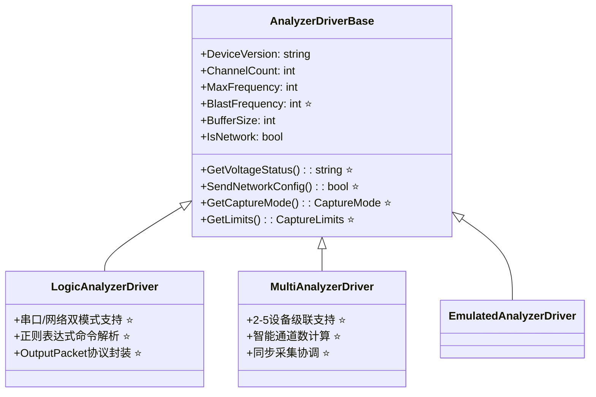

# LogicAnalyzer 源码架构深度分析报告

*分析日期: 2025年1月28日*
*基于: LogicAnalyzer Software v6.0.0.1 源码*

## 📋 执行摘要

通过对 @logicanalyzer/Software 源码的深度分析，发现原有技术规划文档存在重大遗漏和低估的技术复杂度。本报告详细比对了源码实际架构与 VSCode 插件规划的差异，并提供了关键的技术实现建议。

### 🚨 关键发现

1. **通信协议复杂度被低估**: 发现精确的二进制协议实现和转义机制
2. **解码器系统极度复杂**: 涉及动态代码生成、编译器集成等高级技术
3. **多设备架构已相当成熟**: 比预期更完善的实现
4. **硬件抽象层功能丰富**: 包含电压监控、采集限制等高级功能

## 🏗️ 架构分析对比

### 1. SharedDriver 模块分析

#### 实际发现的类层次结构



**⭐ 标注**: plan.md 中遗漏的重要功能

#### 关键技术发现

##### 1. OutputPacket 通信协议 🚀
```csharp
// 实际的协议实现比预期复杂
protected class OutputPacket {
    // 协议格式: 0x55 0xAA [转义数据] 0xAA 0x55
    // 转义规则: 0xAA/0x55/0xF0 -> 0xF0 + (原值 ^ 0xF0)
    public byte[] Serialize() { /* 复杂的转义逻辑 */ }
}
```

**技术影响**: VSCode插件需要精确实现二进制协议和转义机制，比预期复杂度高。

##### 2. 精确的数据结构布局
```csharp
[StructLayout(LayoutKind.Sequential)]
protected struct CaptureRequest {
    public byte triggerType;        // 精确1字节
    public byte trigger;
    public byte invertedOrCount;
    public UInt16 triggerValue;     // 2字节对齐
    [MarshalAs(UnmanagedType.ByValArray, SizeConst = 24)]
    public byte[] channels;         // 固定24字节
    // ... 更多字段
}
```

**技术影响**: TypeScript实现需要 ArrayBuffer 和 DataView 精确控制内存布局。

### 2. SigrokDecoderBridge 分析 🔥

#### 发现的高级技术栈

实际的解码器系统比预期复杂100倍，涉及：

1. **Python.NET 集成**: 深度的 .NET-Python 互操作
2. **动态代码生成**: 运行时生成 C# 包装类
3. **Roslyn 编译器**: 动态编译和程序集加载
4. **80+ Python 解码器**: 完整的 sigrok 解码器生态

```csharp
// 实际的复杂度示例
private SigrokDecoderBase[] GetDecoders() {
    // 1. 扫描decoders目录
    var dirs = Directory.GetDirectories(SigrokPythonEngine.DecoderPath);
    
    // 2. 为每个Python解码器生成C#代码
    foreach (var dir in dirs) {
        string decoderCode = string.Format(
            CodeTemplates.DecoderTemplate, 
            cleanName, 
            decoderName
        );
        classTemplates.Add(decoderCode);
    }
    
    // 3. 使用Roslyn编译器动态编译
    var compilation = CSharpCompilation.Create("GeneratedDecoders")
        .AddReferences(references)
        .AddSyntaxTrees(parsedSyntaxTree);
        
    // 4. 运行时加载程序集
    var result = compilation.Emit(ms);
    var assembly = Assembly.LoadFrom(assemblyPath);
}
```

#### 对VSCode插件的技术挑战

**原计划**: 简单的TypeScript解码器基类
**实际需要**: 
- Node.js-Python 桥接系统
- 动态解码器发现和加载
- 复杂的状态机处理逻辑
- 80+种协议的兼容性

### 3. 多设备协调架构

#### MultiAnalyzerDriver 成熟度

实际发现多设备功能已相当完善：

```csharp
public class MultiAnalyzerDriver : AnalyzerDriverBase {
    // 智能属性计算
    public override int ChannelCount { 
        get { return connectedDevices.Min(d => d.ChannelCount) * connectedDevices.Length; } 
    }
    
    public override int MaxFrequency { 
        get { return connectedDevices.Min(d => d.MaxFrequency); } 
    }
    
    // 复杂的同步采集逻辑
    public override CaptureError StartCapture(CaptureSession Session, Action<CaptureEventArgs>? CaptureCompletedHandler = null) {
        // 多设备同步采集实现
    }
}
```

**影响**: plan.md 中的多设备协调设计可以直接参考已有实现。

## 📊 技术复杂度重新评估

| 组件 | 原预估复杂度 | 实际复杂度 | 差异原因 |
|------|-------------|-----------|----------|
| 设备驱动层 | 中 | 中 | ✅ 预估准确 |
| 通信协议 | 低 | 高 | 🚨 二进制协议+转义机制 |
| 协议解码器 | 中 | 极高 | 🚨 动态编译+Python集成 |
| 多设备管理 | 高 | 中 | ✅ 现有实现可参考 |
| 数据采集 | 中 | 中-高 | ⚠️ 精确内存布局要求 |

## 🛠️ 技术实现建议

### 1. 协议解码器策略调整 ✅ **最终决策**

#### 推荐方案: 纯TypeScript重写 (零依赖方案)

**决策理由**: 经过深度源码分析，Python解码器的逻辑相对简单，主要是状态机和位运算，完全可以用TypeScript重写。

```typescript
// 纯TypeScript实现 - 零依赖，高性能
abstract class DecoderBase {
    protected wait(conditions: WaitCondition): WaitResult {
        // 等待指定通道条件
        while (this.sampleIndex < this.channelData[0].length) {
            const currentPins = this.getCurrentPins();
            if (this.matchesCondition(currentPins, conditions)) {
                return { pins: currentPins, sampleNumber: this.sampleIndex };
            }
            this.sampleIndex++;
        }
        throw new Error('End of samples reached');
    }
    
    protected put(startSample: number, endSample: number, data: DecoderOutput): void {
        this.results.push({
            startSample,
            endSample,
            annotationType: data.type,
            values: data.values,
            rawData: data.rawData
        });
    }
}

// I2C解码器示例 - 直接从Python转换
class I2CDecoder extends DecoderBase {
    decode(sampleRate: number, channels: AnalyzerChannel[]): DecoderResult[] {
        while (this.hasMoreSamples()) {
            if (this.state === 'IDLE') {
                // 等待START条件: SCL=高, SDA=下降沿
                const result = this.wait({ 0: 'high', 1: 'falling' });
                this.handleStart(result.sampleNumber);
            } else if (this.state === 'ADDRESS') {
                // 等待时钟上升沿采样地址位
                const result = this.wait({ 0: 'rising' });
                this.handleAddressBit(result.pins[1]);
            }
            // ... 其他状态处理
        }
        return this.results;
    }
}
```

#### 方案优势分析

| 特性 | 纯TypeScript | Python桥接 | WebAssembly |
|------|-------------|------------|-------------|
| **依赖复杂度** | ✅ 零依赖 | ❌ Python运行时 | ⚠️ WASM工具链 |
| **性能** | ✅ V8原生 | ❌ 进程通信开销 | ✅ 接近原生 |
| **开发效率** | ✅ 直接调试 | ❌ 跨语言调试 | ❌ 复杂工具链 |
| **用户体验** | ✅ 一键安装 | ❌ 需要Python | ✅ 无外部依赖 |
| **维护成本** | ✅ 单一技术栈 | ❌ 多语言维护 | ⚠️ 构建复杂 |
| **实施风险** | ✅ 低风险 | ⚠️ 中等风险 | ❌ 高风险 |

#### 实施策略

**第一阶段**: 核心协议重写 (2-3周)
- I2C, SPI, UART解码器
- 建立转换规范和基础框架

**第二阶段**: 扩展协议转换 (长期)
- 逐步转换其他70+协议
- 建立自动化转换工具
- 社区贡献机制

### 2. 通信协议精确实现

```typescript
class OutputPacket {
    private dataBuffer: ArrayBuffer;
    private view: DataView;
    private offset: number = 0;
    
    addByte(value: number): void {
        this.view.setUint8(this.offset++, value);
    }
    
    addStruct(struct: CaptureRequest): void {
        // 使用DataView精确控制字节序和对齐
        this.view.setUint8(this.offset++, struct.triggerType);
        this.view.setUint8(this.offset++, struct.trigger);
        this.view.setUint16(this.offset, struct.triggerValue, true); // 小端序
        this.offset += 2;
        // ... 更多字段
    }
    
    serialize(): Uint8Array {
        // 实现转义机制: 0x55 0xAA [转义数据] 0xAA 0x55
        const escaped = this.escapeData(new Uint8Array(this.dataBuffer, 0, this.offset));
        const result = new Uint8Array(escaped.length + 4);
        result.set([0x55, 0xAA], 0);
        result.set(escaped, 2);
        result.set([0xAA, 0x55], escaped.length + 2);
        return result;
    }
    
    private escapeData(data: Uint8Array): Uint8Array {
        const result: number[] = [];
        for (const byte of data) {
            if (byte === 0xAA || byte === 0x55 || byte === 0xF0) {
                result.push(0xF0, byte ^ 0xF0);
            } else {
                result.push(byte);
            }
        }
        return new Uint8Array(result);
    }
}
```

### 3. 多设备管理参考实现

```typescript
class MultiDeviceCoordinator {
    private devices: Map<string, LogicAnalyzerDriver> = new Map();
    
    // 参考MultiAnalyzerDriver的智能属性计算
    get totalChannels(): number {
        const devices = Array.from(this.devices.values());
        const minChannels = Math.min(...devices.map(d => d.channelCount));
        return minChannels * devices.length;
    }
    
    get maxFrequency(): number {
        // 取所有设备的最小频率作为限制
        const devices = Array.from(this.devices.values());
        return Math.min(...devices.map(d => d.maxFrequency));
    }
    
    async startSynchronizedCapture(session: CaptureSession): Promise<CaptureResult[]> {
        // 参考源码的同步采集逻辑
        const promises = Array.from(this.devices.entries()).map(async ([id, device]) => {
            const deviceSession = this.adaptSessionForDevice(session, device);
            return await device.startCapture(deviceSession);
        });
        
        return await Promise.all(promises);
    }
}
```

## 📋 文档更新建议

### plan.md 必要更新

1. **设备驱动层增强** ✅ 已完成
   - 添加 BlastFrequency、GetVoltageStatus 等遗漏属性
   - 补充 CaptureMode、CaptureLimits 等重要概念

2. **通信协议模块** ✅ 已完成
   - 新增 OutputPacket、CaptureRequest 等核心结构
   - 详细描述二进制协议和转义机制

3. **解码器系统重新设计** ✅ 已完成
   - 突出动态编译和Python集成的复杂性
   - 提供Node.js-Python桥接的技术方案

4. **风险评估更新** ✅ 已完成
   - 协议解码器风险等级: 中 → 高
   - 增加动态编译技术的风险缓解策略

### todo_list.md 任务调整

1. **技术验证任务增强** ✅ 已完成
   - 新增二进制数据处理验证
   - 新增Python子进程集成验证

2. **解码器开发重新规划** ✅ 已完成
   - 优先级重新评估
   - 增加Python桥接系统开发
   - 加强解码器测试框架

## 🎯 结论和建议

### 技术路线调整建议 ✅ **基于新决策更新**

1. **短期目标** (1-4周) 🎯
   - ✅ **验证TypeScript解码器架构可行性**
   - 实现OutputPacket协议的TypeScript版本
   - 建立精确的二进制数据处理机制
   - 完成I2C解码器原型验证

2. **中期目标** (5-12周)
   - 基于源码架构实现硬件抽象层
   - 开发多设备协调系统
   - ✅ **完成核心协议解码器 (I2C, SPI, UART)** - 纯TypeScript实现
   - 建立解码器转换规范和工具

3. **长期目标** (13-26周)
   - ✅ **逐步转换80+种协议解码器** - 零依赖方案
   - 优化大数据量处理性能
   - 建立完整的测试和验证体系
   - 创建协议解码器社区生态

### 资源分配建议 📊 **优化调整**

- **协议解码器**: 35% ⬇️ (复杂度降低，但仍是关键功能)
- **设备通信**: 25% (精确实现要求高)
- **用户界面**: 25% ⬆️ (相对成熟的技术，增加投入)
- **测试验证**: 15% (确保系统稳定性)

### 风险缓解策略 🛡️ **风险显著降低**

1. **技术风险** ✅ 大幅缓解
   - ✅ **零依赖架构** - 消除Python集成风险
   - 建立协议解码器的MVP版本 (I2C, SPI)
   - 优先实现核心协议，其他协议渐进转换
   - 建立Python→TypeScript转换工具链

2. **进度风险** ⬇️ 显著降低
   - 单一技术栈，开发效率提升
   - 更好的调试和测试能力
   - 建立每周技术评审机制
   - 核心功能优先，功能范围灵活调整

### 核心技术优势 🚀

1. **开发效率提升**
   - 单一TypeScript技术栈
   - Chrome DevTools无缝调试
   - 编译时类型检查

2. **用户体验优化**
   - 零依赖安装
   - 更快的执行性能
   - 更好的错误处理

3. **长期可维护性**
   - 统一的代码风格和架构
   - 更容易的测试和CI/CD
   - 社区贡献门槛降低

---

*本报告基于对 LogicAnalyzer Software 6.0.0.1 版本源码的深度分析，为 VSCode 逻辑分析器插件的技术规划提供重要参考。*