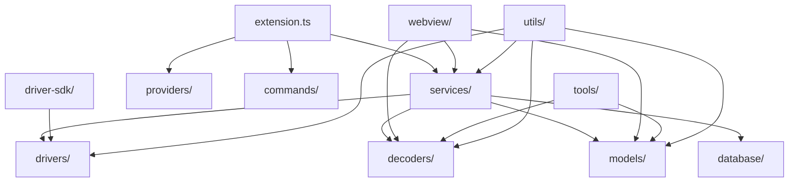

# VSCode 逻辑分析器插件 - src 目录结构详解

## 项目架构概览

VSCode 逻辑分析器插件采用分层架构设计，遵循硬件生态优先的开放式平台理念。src 目录包含了从硬件驱动到用户界面的完整技术栈，采用纯 TypeScript 实现，确保类型安全和开发体验。

### 架构分层图
```
┌─────────────────────────────────────────────────┐
│                用户界面层                         │
│              webview/ (Vue3)                    │
├─────────────────────────────────────────────────┤
│                业务服务层                         │
│        services/ │ providers/ │ commands/       │
├─────────────────────────────────────────────────┤
│                核心业务层                         │
│     drivers/ │ decoders/ │ models/             │
├─────────────────────────────────────────────────┤
│               开发者生态层                         │
│        driver-sdk/ │ database/                  │
├─────────────────────────────────────────────────┤
│               基础设施层                          │
│           tools/ │ utils/                      │
└─────────────────────────────────────────────────┘
```

## 一、核心架构层

### 1. drivers/ - 硬件抽象层 (HAL)
**职责**: 实现统一的硬件驱动接口，支持多品牌逻辑分析器设备

**关键文件**:
- `AnalyzerDriverBase.ts` - 硬件驱动抽象基类，定义统一接口
- `HardwareDriverManager.ts` - 驱动管理器，负责设备发现和连接
- `LogicAnalyzerDriver.ts` - Pico Logic Analyzer 专用驱动
- `SaleaeLogicDriver.ts` - Saleae Logic 系列驱动
- `RigolSiglentDriver.ts` - Rigol/Siglent 设备驱动
- `NetworkLogicAnalyzerDriver.ts` - 网络逻辑分析器驱动
- `MultiAnalyzerDriver.ts` - 多设备同步驱动

**子目录**:
- `standards/` - 硬件描述标准和规范
- `types/` - 驱动相关类型定义

**技术特点**:
- 严格实现 ILogicAnalyzer 接口
- 支持设备能力动态发现
- 统一的错误处理和状态管理
- 支持热插拔和多设备并发

### 2. decoders/ - 协议解码层
**职责**: 纯 TypeScript 实现的协议解码器，零外部依赖

**关键文件**:
- `DecoderBase.ts` - 解码器抽象基类
- `DecoderManager.ts` - 解码器管理和调度
- `DecoderRegistry.ts` - 解码器注册中心
- `StreamingDecoder.ts` - 流式解码实现
- `PerformanceOptimizer.ts` - 解码性能优化器

**子目录**:
- `protocols/` - 具体协议实现
  - `I2CDecoder.ts` - I2C 协议解码器
  - `SPIDecoder.ts` - SPI 协议解码器
  - `UARTDecoder.ts` - UART 协议解码器
  - `StreamingI2CDecoder.ts` - I2C 流式解码器
- `tests/` - 解码器测试框架

**技术特点**:
- 完全避免 Python 依赖
- 支持实时流式解码
- 内置性能优化和内存管理
- 可扩展的协议注册机制

### 3. models/ - 数据模型层
**职责**: 定义统一的数据格式和处理逻辑

**关键文件**:
- `UnifiedDataFormat.ts` - 统一数据格式定义
- `LACFileFormat.ts` - LAC 文件格式支持
- `CaptureModels.ts` - 数据捕获模型
- `CaptureSession.ts` - 捕获会话管理
- `BinaryDataParser.ts` - 二进制数据解析
- `DataCompression.ts` - 数据压缩算法
- `DataStreamProcessor.ts` - 数据流处理器
- `TriggerProcessor.ts` - 触发器处理逻辑

**技术特点**:
- 100% 兼容原 @logicanalyzer/Software 的 .lac 格式
- 支持大数据量的内存高效处理
- 实时数据质量监控
- 可扩展的数据格式架构

### 4. webview/ - 用户界面层
**职责**: 基于 Vue3 + Element Plus 的现代化用户界面

**核心文件**:
- `App.vue` - 应用主组件
- `main.ts` - Vue 应用入口
- `index.html` - HTML 模板

**子目录**:
- `components/` - Vue 组件库
  - `DeviceManager.vue` - 设备管理组件
  - `CaptureSettings.vue` - 捕获设置组件
  - `ChannelPanel.vue` - 通道面板组件
  - `DecoderPanel.vue` - 解码器面板
  - `DataExporter.vue` - 数据导出组件
  - `MeasurementTools.vue` - 测量工具组件
  - `PerformanceAnalyzer.vue` - 性能分析器
  - `ThemeManager.vue` - 主题管理器
  - `LanguageSwitcher.vue` - 语言切换器

- `engines/` - 渲染引擎
  - `WaveformRenderer.ts` - 波形渲染引擎
  - `EnhancedWaveformRenderer.ts` - 增强波形渲染器
  - `AnnotationRenderer.ts` - 注释渲染器
  - `TimeAxisRenderer.ts` - 时间轴渲染器
  - `VirtualizationRenderer.ts` - 虚拟化渲染器
  - `InteractionEngine.ts` - 交互引擎
  - `PerformanceOptimizer.ts` - 渲染性能优化器

- `i18n/` - 国际化支持
  - `locales/en-US.ts` - 英文语言包
  - `locales/zh-CN.ts` - 中文语言包

**技术特点**:
- Vue3 组合式 API + TypeScript
- 支持 100 万数据点 @ 60fps 渲染
- Canvas 高性能波形渲染
- 响应式设计和主题系统
- 完整的国际化支持

## 二、业务服务层

### 5. services/ - 业务服务
**职责**: 提供各种业务逻辑服务

**关键文件**:
- `SessionManager.ts` - 会话管理服务
- `ConfigurationManager.ts` - 配置管理服务
- `DataExportService.ts` - 数据导出服务
- `WorkspaceManager.ts` - 工作空间管理
- `SignalMeasurementService.ts` - 信号测量服务
- `PulseTimingAnalyzer.ts` - 脉冲时序分析器

**技术特点**:
- 单例模式和依赖注入
- 异步服务架构
- 配置热重载支持
- 完整的错误恢复机制

### 6. providers/ - VSCode 集成层
**职责**: VSCode 编辑器集成和提供者

**关键文件**:
- `LACEditorProvider.ts` - LAC 文件编辑器提供者

**技术特点**:
- 自定义编辑器集成
- VSCode API 深度集成
- 文件关联和语法高亮

### 7. commands/ - 命令系统
**职责**: VSCode 命令注册和处理

**技术特点**:
- 命令注册和路由
- 快捷键绑定支持
- 命令参数验证

## 三、开发者生态层

### 8. driver-sdk/ - 第三方驱动开发 SDK
**职责**: 为第三方开发者提供完整的驱动开发支持

**子目录**:
- `docs/` - 开发者文档
  - `DEVELOPER_GUIDE.md` - 详细开发指南
- `examples/` - 示例驱动实现
  - `ExampleSerialDriver.ts` - 串口驱动示例
  - `ExampleNetworkDriver.ts` - 网络驱动示例
- `templates/` - 驱动模板
  - `GenericDriverTemplate.ts` - 通用驱动模板
  - `SerialDriverTemplate.ts` - 串口驱动模板
  - `NetworkDriverTemplate.ts` - 网络驱动模板
- `testing/` - 测试框架
  - `TestFramework.ts` - 测试框架基础
  - `AutomatedTestRunner.ts` - 自动化测试运行器
- `tools/` - 开发工具
  - `DriverTester.ts` - 驱动测试器
  - `DriverValidator.ts` - 驱动验证器
  - `HardwareCapabilityBuilder.ts` - 硬件能力构建器
  - `ProtocolHelper.ts` - 协议助手工具

**技术特点**:
- 完整的 SDK 文档和示例
- 自动化测试和验证工具
- 标准化的驱动模板
- 开发者友好的工具链

### 9. database/ - 硬件兼容性数据库
**职责**: 维护硬件设备兼容性信息

**关键文件**:
- `HardwareCompatibilityDatabase.ts` - 硬件兼容性数据库
- `DatabaseManager.ts` - 数据库管理器
- `DatabaseIntegration.ts` - 数据库集成层

**技术特点**:
- 设备指纹识别
- 兼容性评分系统
- 自动更新机制
- 离线查询支持

## 四、基础设施层

### 10. tools/ - 开发工具
**职责**: 开发和调试工具

**关键文件**:
- `PythonDecoderAnalyzer.ts` - Python 解码器分析工具
- `TypeScriptCodeGenerator.ts` - TypeScript 代码生成器

**技术特点**:
- 代码生成和转换工具
- 性能分析和优化工具
- 调试和诊断支持

### 11. utils/ - 工具函数
**职责**: 通用工具函数和助手类

**关键文件**:
- `MemoryManager.ts` - 内存管理工具
- `DecoderBenchmark.ts` - 解码器基准测试

**技术特点**:
- 高效的内存管理
- 性能基准测试工具
- 通用算法实现

## 五、入口文件

### 12. extension.ts - VSCode 扩展主入口
**职责**: VSCode 扩展的激活和生命周期管理

**技术特点**:
- 扩展激活和注销
- 服务初始化和依赖注入
- 全局错误处理
- 性能监控和日志记录

## 模块依赖关系



## 架构约束

### 技术约束
- **纯 TypeScript**: 所有代码必须使用 TypeScript，严格模式开启
- **零 Python 依赖**: 解码器必须使用纯 TypeScript 实现
- **接口稳定性**: 核心接口不得随意修改
- **性能要求**: 支持 100 万数据点 @ 60fps 渲染

### 开发约束
- **模块化设计**: 每个模块职责清晰，低耦合高内聚
- **测试覆盖**: 单元测试覆盖率 > 80%
- **文档完整**: 所有公共接口必须有完整的 TypeDoc 注释
- **代码风格**: 遵循 ESLint 和 Prettier 规范

## 扩展指南

### 添加新硬件驱动
1. 继承 `AnalyzerDriverBase` 类
2. 实现 `ILogicAnalyzer` 接口
3. 在 `HardwareDriverManager` 中注册
4. 添加相应的测试用例

### 添加新协议解码器
1. 继承 `DecoderBase` 类
2. 实现协议解码逻辑
3. 在 `DecoderRegistry` 中注册
4. 添加单元测试和集成测试

### 扩展用户界面
1. 在 `webview/components/` 中添加 Vue 组件
2. 使用 Element Plus 组件库
3. 遵循现有的设计系统和主题
4. 支持国际化

## 总结

VSCode 逻辑分析器插件的 src 目录采用了清晰的分层架构，从底层的硬件抽象到顶层的用户界面，每个模块都有明确的职责和边界。这种设计不仅保证了代码的可维护性和可扩展性，更重要的是为构建开放的硬件生态系统奠定了坚实的技术基础。

通过硬件抽象层的统一接口、协议解码器的零依赖实现、以及完整的第三方开发者 SDK，该架构能够支持多品牌硬件设备，并为第三方开发者提供便捷的扩展能力，真正实现了"硬件生态优先"的设计理念。