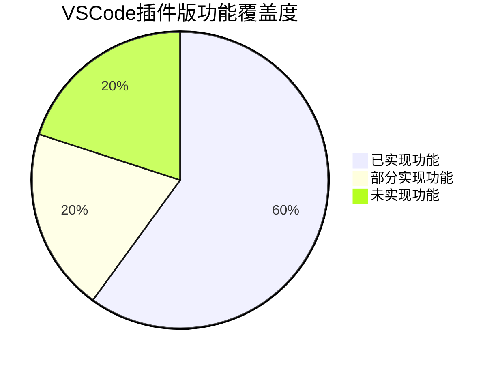

# 📋 执行摘要

[← 返回目录](./README.md) | [下一章：架构对比 →](./02-架构对比分析.md)

---

## 项目概述

本章节提供VSCode插件版与原版逻辑分析仪的对比分析总览。

### 对比对象

1. **原版逻辑分析仪 (LogicAnalyzer)** - 基于 C#/.NET 8 和 AvaloniaUI 的完整桌面应用解决方案
2. **VSCode 插件版** - 基于 TypeScript 和 Vue3 的 VSCode 扩展实现

## 关键发现总览

### 功能完整性评估

| 对比维度 | 原版逻辑分析仪 | VSCode插件版 | 实现度评级 | 差异程度 |
|---------|--------------|-------------|----------|---------|
| **核心硬件通信** | ✅ 完整 | ✅ 完整 | 100% | 无差异 |
| **数据采集功能** | ✅ 完整 | ⚠️ 基础 | 80% | 轻微差距 |
| **波形显示** | ✅ 成熟 | ✅ 现代 | 85% | 实现方式不同 |
| **协议解码** | ✅ 70+协议 | ⚠️ 3协议 | 5% | **显著差距** |
| **高级功能** | ✅ 丰富 | ❌ 缺失 | 30% | **重大差距** |
| **用户界面** | ✅ 专业 | ✅ 现代 | 90% | 技术栈不同 |
| **跨平台支持** | ✅ 完整 | ✅ 完整 | 100% | 无差异 |

### 整体功能覆盖度



## 核心差异点分析

### ✅ VSCode插件版的优势

#### 1. 现代化开发体验
- **无缝VSCode集成**: 直接在开发环境中使用，无需切换工具
- **现代化UI**: Vue3 + Element Plus提供流畅的用户体验
- **轻量化部署**: 作为VSCode插件，安装简单
- **开发者友好**: TypeScript开发，代码可读性高

#### 2. 用户界面优势
- **响应式设计**: 适应不同屏幕尺寸
- **组件化架构**: 界面模块化，便于维护
- **国际化支持**: 内置多语言切换
- **主题自适应**: 自动适应VSCode主题

#### 3. 技术栈优势
- **跨平台一致性**: 基于Web技术，表现一致
- **快速迭代**: TypeScript开发效率高
- **社区生态**: 利用NPM丰富的包生态

### ⚠️ VSCode插件版的不足

#### 1. 协议支持严重不足
```typescript
// 原版：70+协议支持
const originalProtocols = [
  'I2C', 'SPI', 'UART', 'CAN', 'LIN', 'USB', 'Ethernet',
  'JTAG', 'SWD', 'SD Card', 'EEPROM', 'NRF24L01',
  // ... 还有60+种协议
];

// VSCode插件版：仅3种基础协议
const pluginProtocols = ['I2C', 'SPI', 'UART'];
```

#### 2. 高级功能缺失
- **多设备级联**: 无法实现120通道采集
- **突发模式**: 不支持多次触发采集
- **WiFi高级功能**: 缺少网络配置、诊断等功能
- **信号描述语言**: 无SDL信号生成功能

#### 3. 性能和深度限制
- **解码性能**: 纯TS实现性能不如原版Python+C#方案
- **功能深度**: 测量工具、分析功能相对简单
- **扩展性**: 协议扩展机制不如Sigrok生态

## 技术架构差异总结

### 开发技术栈对比

| 技术层面 | 原版逻辑分析仪 | VSCode插件版 | 架构影响 |
|---------|---------------|-------------|---------|
| **开发语言** | C# (.NET 8) | TypeScript | 性能 vs 开发效率 |
| **UI框架** | AvaloniaUI | Vue3 + Element Plus | 桌面 vs Web体验 |
| **协议解码** | Sigrok + Python | 纯TypeScript | 功能完整 vs 维护简单 |
| **数据处理** | 不安全代码优化 | V8引擎执行 | 高性能 vs 跨平台 |
| **部署方式** | 独立应用 | VSCode扩展 | 独立性 vs 集成性 |

### 目标用户群体

#### 原版逻辑分析仪适合
- **电子工程师**: 需要专业分析工具
- **硬件调试**: 需要深度协议分析
- **生产测试**: 需要稳定可靠的独立工具
- **教育培训**: 需要完整功能的教学工具

#### VSCode插件版适合
- **嵌入式开发者**: 在开发环境中直接使用
- **快速调试**: 简单协议的快速分析
- **学习入门**: 界面友好的入门工具
- **轻量使用**: 偶尔使用的简单场景

## 用户选择建议

### 选择原版逻辑分析仪的情况
✅ 需要专业级功能完整性
✅ 需要大量协议解码支持
✅ 需要高级分析和测量功能
✅ 需要生产环境稳定性
✅ 需要多设备级联等高端功能

### 选择VSCode插件版的情况
✅ 主要在VSCode中开发
✅ 只需要基础协议分析（I2C/SPI/UART）
✅ 追求现代化用户界面
✅ 需要轻量化工具集成
✅ 学习和入门用途

## 发展潜力评估

### VSCode插件版的发展前景

#### 短期潜力 (3-6个月)
- **协议扩展**: 可快速增加CAN、JTAG等重要协议
- **功能补强**: 可实现突发模式、高级测量等功能
- **性能优化**: 通过WebWorker等技术提升解码性能

#### 中期潜力 (6-12个月)
- **生态建设**: 建立协议插件生态系统
- **功能对齐**: 实现原版80%以上功能
- **专业化**: 添加高级分析和测量工具

#### 长期潜力 (1-2年)
- **完全替代**: 在嵌入式开发领域替代独立工具
- **创新功能**: 利用VSCode生态创造独特价值
- **市场定位**: 成为开发者首选的集成化分析工具

## 结论与建议

### 核心结论

1. **VSCode插件版已具备核心能力**，实现了60%的原版功能
2. **协议支持是最大短板**，需要优先补齐常用协议
3. **用户界面具有明显优势**，现代化程度更高
4. **发展潜力巨大**，有望在特定领域超越原版

### 关键建议

#### 对开发团队
- **优先级排序**: 协议解码器 > 高级功能 > UI优化
- **实施策略**: 渐进式开发，先易后难
- **质量保证**: 确保新功能质量不低于原版对应功能

#### 对用户选择
- **当前阶段**: 根据实际需求选择合适版本
- **未来趋势**: VSCode插件版将逐步成为主流选择
- **迁移准备**: 可以开始尝试插件版，为未来迁移做准备

---

[← 返回目录](./README.md) | [下一章：架构对比 →](./02-架构对比分析.md)