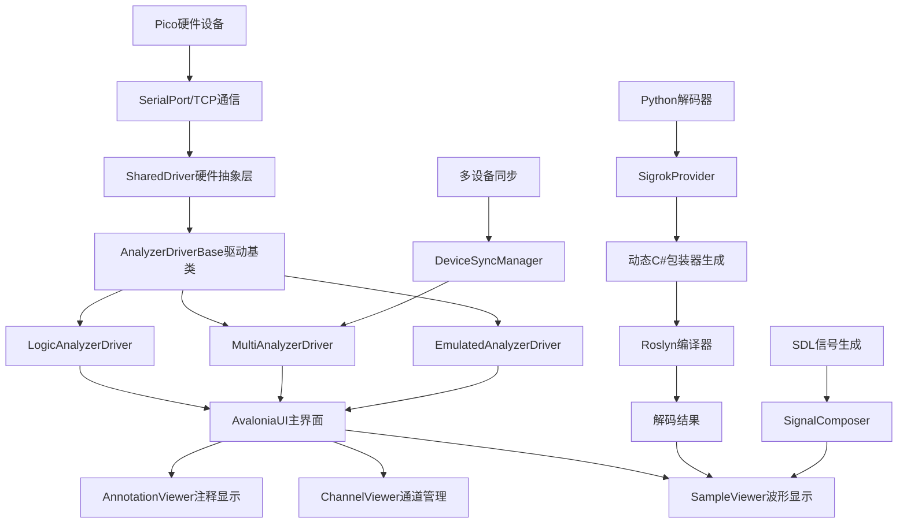
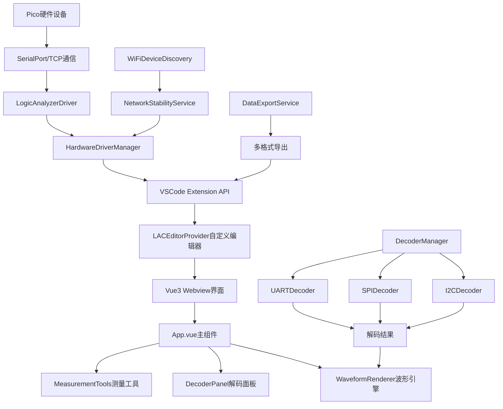

# 🏗️ 架构对比分析

[← 上一章：执行摘要](./01-执行摘要.md) | [返回目录](./README.md) | [下一章：功能对比表 →](./03-详细功能对比表.md)

---

## 技术栈全面对比

### 开发框架与语言

| 技术维度 | 原版逻辑分析仪 | VSCode插件版 | 技术特点对比 |
|---------|---------------|-------------|-------------|
| **主要语言** | C# (.NET 8) | TypeScript (ES2020) | 编译语言 vs 解释语言 |
| **UI框架** | AvaloniaUI 11.2.3 | Vue 3.4 + Element Plus | 原生桌面 vs Web组件 |
| **协议解码** | pythonnet + Sigrok | 纯TypeScript实现 | 生态丰富 vs 维护简单 |
| **数据处理** | 不安全代码优化 | V8引擎执行 | 内存直接访问 vs 内存安全 |
| **构建系统** | MSBuild + NuGet | Webpack + NPM | .NET生态 vs Node.js生态 |
| **包管理** | NuGet | NPM | 企业级包管理 vs 开源生态 |

### 运行环境对比

#### 原版逻辑分析仪运行环境
```csharp
// .NET 8 运行时环境
- Target Framework: net8.0-windows/linux/macos
- Runtime: .NET 8 Runtime
- Memory Management: GC + 手动内存管理
- Thread Model: Task-based Async Pattern
- UI Thread: STA线程模型
- Performance: AOT编译优化
```

#### VSCode插件版运行环境
```typescript
// Node.js + VSCode Extension Host环境
- Runtime: Node.js 18+ + V8引擎
- Extension Host: VSCode Extension API
- Memory Management: V8垃圾回收
- Thread Model: Event Loop + WebWorker
- UI Thread: Webview + Web技术栈
- Performance: JIT编译 + 热优化
```

## 系统架构深度对比

### 原版架构设计



### VSCode插件版架构



### 架构设计哲学对比

#### 原版设计哲学：专业工具优先
```csharp
// 优先级：功能完整性 > 性能 > 易用性
public abstract class AnalyzerDriverBase {
    // 专业功能导向的设计
    public abstract int MaxFrequency { get; }      // 最大采样率
    public abstract int BufferSize { get; }        // 缓冲区大小
    public abstract int ChannelCount { get; }      // 通道数量

    // 复杂但完整的功能支持
    public abstract Task<CaptureSession> StartBurstCapture(BurstConfig config);
    public abstract Task<MultiDeviceResult> StartSyncedCapture(SyncConfig config);
    public abstract Task<bool> UpdateFirmware(byte[] firmwareData);
}
```

#### 插件版设计哲学：开发体验优先
```typescript
// 优先级：易用性 > 集成性 > 功能完整性
export interface AnalyzerDriverInterface {
  // 简化的接口设计，注重易用性
  connect(params?: ConnectionParams): Promise<ConnectionResult>;
  startCapture(session: CaptureSession): Promise<CaptureResult>;
  disconnect(): Promise<void>;

  // 专注核心功能，避免复杂性
  readonly isConnected: boolean;
  readonly deviceInfo: DeviceInfo | null;
  readonly capabilities: HardwareCapabilities;
}
```

## 模块化设计对比

### 原版模块化架构

#### 核心模块分层
```csharp
// 1. 硬件抽象层 (Hardware Abstraction Layer)
namespace SharedDriver {
    public class LogicAnalyzerDriver : AnalyzerDriverBase
    public class MultiAnalyzerDriver : AnalyzerDriverBase
    public class DeviceDetector
    public class VersionValidator
}

// 2. 协议解码层 (Protocol Decoding Layer)
namespace SigrokDecoderBridge {
    public class SigrokProvider
    public class SigrokPythonEngine
    public class DecoderTemplate
    public class DynamicAssemblyGenerator
}

// 3. 用户界面层 (User Interface Layer)
namespace LogicAnalyzer.Views {
    public class MainWindow : PersistableWindowBase
    public class SampleViewer : UserControl, ISampleDisplay
    public class CaptureDialog : Window
    public class NetworkDialog : Window
}

// 4. 业务逻辑层 (Business Logic Layer)
namespace LogicAnalyzer.Services {
    public class CaptureSession
    public class AnalysisSettings
    public class ExportManager
    public class SignalComposer
}
```

### VSCode插件版模块化架构

#### 功能模块分层
```typescript
// 1. VSCode集成层 (VSCode Integration Layer)
// src/extension.ts - 插件入口点
// src/providers/ - VSCode API适配器
export class LACEditorProvider implements CustomTextEditorProvider

// 2. 硬件通信层 (Hardware Communication Layer)
// src/drivers/ - 硬件驱动
export class LogicAnalyzerDriver extends AnalyzerDriverBase
export class NetworkLogicAnalyzerDriver extends LogicAnalyzerDriver

// 3. 协议解码层 (Protocol Decoding Layer)
// src/decoders/ - 协议解码器
export class DecoderManager
export class I2CDecoder extends DecoderBase
export class SPIDecoder extends DecoderBase

// 4. 用户界面层 (User Interface Layer)
// src/webview/ - Vue3组件
export default App.vue  // 主界面组件
export default DecoderPanel.vue  // 解码器面板
export default WaveformRenderer.ts  // 波形渲染引擎

// 5. 数据服务层 (Data Service Layer)
// src/services/ - 业务服务
export class DataExportService
export class SessionManager
export class WiFiDeviceDiscovery
```

## 性能架构对比

### 原版性能优化策略

#### 1. 内存管理优化
```csharp
// 使用不安全代码进行性能优化
public unsafe class HighPerformanceDataProcessor {
    private fixed byte buffer[1024 * 1024];  // 固定内存缓冲区

    public void ProcessSamples(byte* data, int length) {
        // 直接内存操作，避免GC压力
        for(int i = 0; i < length; i++) {
            buffer[i] = *(data + i);
        }
    }
}
```

#### 2. 多线程并发处理
```csharp
// 基于TPL的并行处理
public class ParallelDecoderProcessor {
    public async Task<DecodedResult[]> DecodeParallel(
        SampleData data,
        IDecoder[] decoders
    ) {
        var tasks = decoders.Select(decoder =>
            Task.Run(() => decoder.Decode(data))
        );
        return await Task.WhenAll(tasks);
    }
}
```

#### 3. 原生UI渲染
```csharp
// Avalonia原生Canvas渲染
public class HighPerformanceWaveformRenderer {
    private WriteableBitmap bitmap;

    public void RenderWaveform(Sample[] samples) {
        using(var context = bitmap.Lock()) {
            unsafe {
                var ptr = (uint*)context.Address;
                // 直接像素操作，最高性能
                DrawWaveformDirect(ptr, samples);
            }
        }
    }
}
```

### VSCode插件版性能策略

#### 1. V8引擎优化
```typescript
// 利用V8优化的数据结构
export class OptimizedSampleBuffer {
  private buffer: Uint8Array;
  private view: DataView;

  constructor(size: number) {
    // 使用TypedArray获得接近原生性能
    this.buffer = new Uint8Array(size);
    this.view = new DataView(this.buffer.buffer);
  }

  processSamples(offset: number, length: number): void {
    // V8会将这样的循环编译为优化的机器码
    for(let i = 0; i < length; i++) {
      this.view.setUint8(offset + i, this.buffer[offset + i] ^ 0xFF);
    }
  }
}
```

#### 2. WebWorker并行解码
```typescript
// 使用WebWorker进行并行解码
export class ParallelDecoderManager {
  private workers: Worker[] = [];

  async decodeInParallel(
    data: ChannelData[],
    decoders: DecoderConfig[]
  ): Promise<Map<string, DecoderResult[]>> {
    const tasks = decoders.map((config, index) =>
      this.decodeInWorker(this.workers[index % this.workers.length], data, config)
    );

    const results = await Promise.all(tasks);
    return new Map(results);
  }
}
```

#### 3. Canvas/WebGL渲染优化
```typescript
// WebGL加速的波形渲染
export class WebGLWaveformRenderer {
  private gl: WebGLRenderingContext;
  private vertexBuffer: WebGLBuffer;

  renderWaveform(samples: Float32Array): void {
    // 使用GPU加速渲染
    this.gl.bindBuffer(this.gl.ARRAY_BUFFER, this.vertexBuffer);
    this.gl.bufferData(this.gl.ARRAY_BUFFER, samples, this.gl.DYNAMIC_DRAW);

    // GPU并行处理波形渲染
    this.gl.drawArrays(this.gl.LINE_STRIP, 0, samples.length / 2);
  }
}
```

## 扩展性架构对比

### 原版扩展性设计

#### 1. Python解码器生态
```python
# 标准Sigrok解码器接口
class Decoder(srd.Decoder):
    api_version = 3
    id = 'custom_protocol'
    name = 'Custom Protocol'

    def decode(self, ss, es, data):
        # 完整的Sigrok生态支持
        # 自动状态机管理
        # 复杂条件判断支持
        pass
```

#### 2. 插件化架构
```csharp
// 动态程序集加载
public class PluginLoader {
    public IDecoder[] LoadDecodersFromDirectory(string path) {
        var assemblies = Directory.GetFiles(path, "*.dll")
            .Select(Assembly.LoadFrom);

        return assemblies.SelectMany(asm =>
            asm.GetTypes()
                .Where(t => t.Implements<IDecoder>())
                .Select(t => (IDecoder)Activator.CreateInstance(t))
        ).ToArray();
    }
}
```

### VSCode插件版扩展性

#### 1. TypeScript协议扩展
```typescript
// 类型安全的协议扩展
export interface DecoderPlugin {
  id: string;
  name: string;
  decoder: new() => DecoderBase;
  configSchema: JsonSchema;
}

export class DecoderRegistry {
  private plugins = new Map<string, DecoderPlugin>();

  register(plugin: DecoderPlugin): void {
    // 类型检查和运行时验证
    this.validatePlugin(plugin);
    this.plugins.set(plugin.id, plugin);
  }
}
```

#### 2. VSCode生态集成
```typescript
// 利用VSCode扩展机制
export function activate(context: vscode.ExtensionContext) {
  // 集成VSCode命令系统
  const commands = [
    vscode.commands.registerCommand('logicAnalyzer.addCustomDecoder',
      () => loadCustomDecoder()
    ),
    vscode.commands.registerCommand('logicAnalyzer.exportToSigrok',
      () => exportData()
    )
  ];

  context.subscriptions.push(...commands);
}
```

## 部署架构对比

### 原版部署模式

#### 独立应用部署
```xml
<!-- 自包含部署配置 -->
<PropertyGroup>
    <PublishSingleFile>true</PublishSingleFile>
    <SelfContained>true</SelfContained>
    <RuntimeIdentifier>win-x64</RuntimeIdentifier>
    <PublishTrimmed>true</PublishTrimmed>
</PropertyGroup>
```

**优势**:
- 完全独立运行，无依赖
- 性能最优，启动快速
- 专业工具标准部署方式

**劣势**:
- 安装包较大（100MB+）
- 需要单独安装和维护
- 更新机制需要自实现

### VSCode插件版部署

#### 扩展市场部署
```json
{
  "name": "vscode-logic-analyzer",
  "engines": {
    "vscode": "^1.74.0"
  },
  "main": "./out/extension.js",
  "activationEvents": ["onLanguage:logicanalyzer"]
}
```

**优势**:
- 一键安装，集成到开发环境
- 自动更新机制
- 轻量化，利用VSCode基础设施

**劣势**:
- 依赖VSCode环境
- 性能受限于扩展宿主环境
- 功能受VSCode API限制

## 总结与建议

### 架构特点总结

| 架构维度 | 原版逻辑分析仪 | VSCode插件版 | 推荐场景 |
|---------|---------------|-------------|---------|
| **性能** | 极高 | 高 | 原版适合专业分析 |
| **集成性** | 独立 | 极高 | 插件版适合开发流程 |
| **扩展性** | 复杂但强大 | 简单但有限 | 看具体需求 |
| **维护性** | 中等 | 高 | 插件版更易维护 |
| **学习成本** | 高 | 低 | 插件版更友好 |

### 架构发展建议

#### 短期优化 (3-6个月)
1. **性能提升**: 使用SharedArrayBuffer和WebAssembly优化关键路径
2. **模块化改进**: 重构解码器架构，支持更灵活的扩展
3. **API标准化**: 建立与原版兼容的协议接口标准

#### 长期演进 (6-12个月)
1. **混合架构**: 考虑Native模块 + TypeScript的混合方案
2. **独立模式**: 支持脱离VSCode运行的独立模式
3. **云端集成**: 集成云端分析和协作功能

---

[← 上一章：执行摘要](./01-执行摘要.md) | [返回目录](./README.md) | [下一章：功能对比表 →](./03-详细功能对比表.md)