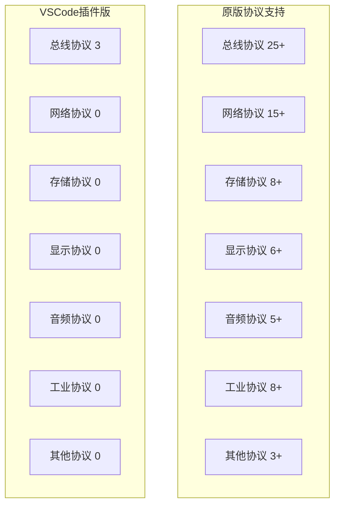

# 📡 协议支持对比分析

[← 上一章：未实现功能](./06-未实现功能清单.md) | [返回目录](./README.md) | [下一章：开发建议 →](./08-开发建议和路线图.md)

---

## 概述

协议解码器是逻辑分析仪的核心功能之一，直接决定了工具的专业应用价值。本章详细对比两个版本的协议支持情况，分析差距和改进方向。

## 协议支持总览

### 数量统计对比

| 版本 | 支持协议数 | 完整实现 | 基础实现 | 规划中 |
|------|-----------|---------|---------|--------|
| **原版 (Sigrok)** | **70+** | 65 | 8 | - |
| **VSCode插件版** | **3** | 2 | 1 | 67+ |
| **支持率** | **4.3%** | 3.1% | 12.5% | - |

### 协议分类对比



## 已实现协议详细对比

### I2C协议解码器

#### 原版 (Sigrok) - 功能完整
```python
# Sigrok I2C解码器特性
class I2CDecoder(srd.Decoder):
    # 完整的协议变体支持
    VARIANTS = [
        'i2c-standard',     # 标准模式 (100 kHz)
        'i2c-fast',         # 快速模式 (400 kHz)
        'i2c-fast-plus',    # 快速+模式 (1 MHz)
        'i2c-high-speed',   # 高速模式 (3.4 MHz)
        'i2c-ultra-fast',   # 超快速模式 (5 MHz)
        'smbus',            # SMBus协议
        'pmbus'             # PMBus协议
    ]

    # 高级解码功能
    def decode_advanced_features(self):
        # 1. 自动地址格式检测
        if self.detect_10bit_address():
            self.address_format = '10-bit'
        else:
            self.address_format = '7-bit'

        # 2. 协议错误检测
        if not self.validate_start_condition():
            self.put_error('Invalid start condition')

        # 3. 时序违规检测
        if not self.check_timing_compliance():
            self.put_warning('Timing violation detected')

        # 4. SMBus协议层解析
        if self.is_smbus_transaction():
            self.decode_smbus_command()

        # 5. 重复起始条件处理
        if self.detect_repeated_start():
            self.put_annotation('Repeated Start')
```

#### VSCode插件版 - 基础实现
```typescript
// VSCode插件I2C解码器 - 功能有限
export class I2CDecoder extends DecoderBase {
  readonly id = 'i2c';
  readonly name = 'I2C';
  readonly channels = [
    { id: 'sda', name: 'SDA', description: 'Serial Data' },
    { id: 'scl', name: 'SCL', description: 'Serial Clock' }
  ];

  // 仅支持基础7位地址格式
  decode(sampleRate: number, channels: ChannelData[]): DecoderResult[] {
    const results: DecoderResult[] = [];
    let state: I2CState = 'IDLE';

    // 简化的状态机 - 仅处理基本事务
    for (let i = 0; i < channels[0].samples.length - 1; i++) {
      const sda = channels[0].samples[i];
      const scl = channels[1].samples[i];
      const nextSda = channels[0].samples[i + 1];
      const nextScl = channels[1].samples[i + 1];

      switch (state) {
        case 'IDLE':
          // 检测起始条件：SDA下降沿，SCL高电平
          if (sda === 1 && nextSda === 0 && scl === 1) {
            results.push({
              startSample: i,
              endSample: i + 1,
              type: 'start',
              value: undefined,
              annotation: 'START'
            });
            state = 'ADDRESS';
          }
          break;

        // ... 其他基础状态处理
      }
    }

    return results;
  }
}
```

#### 功能对比

| 功能特性 | 原版 (Sigrok) | VSCode插件版 | 完成度 |
|---------|--------------|-------------|--------|
| **地址格式** | 7位 + 10位 | 仅7位 | 50% |
| **速度支持** | 5种模式 | 通用 | 20% |
| **错误检测** | 完整 | 无 | 0% |
| **协议变体** | SMBus/PMBus | 无 | 0% |
| **时序验证** | 完整 | 无 | 0% |
| **总体评分** | ⭐⭐⭐⭐⭐ | ⭐⭐ | **40%** |

### SPI协议解码器

#### 原版 (Sigrok) - 高级功能
```python
# Sigrok SPI解码器 - 专业级实现
class SPIDecoder(srd.Decoder):
    def __init__(self):
        # 支持多种SPI变体
        self.spi_modes = {
            0: {'cpol': 0, 'cpha': 0},  # Mode 0
            1: {'cpol': 0, 'cpha': 1},  # Mode 1
            2: {'cpol': 1, 'cpha': 0},  # Mode 2
            3: {'cpol': 1, 'cpha': 1}   # Mode 3
        }

        # 高级配置选项
        self.options = {
            'wordsize': [8, 16, 32],           # 字长支持
            'bitorder': ['msb-first', 'lsb-first'], # 位序
            'cs_polarity': ['active-low', 'active-high'], # 片选极性
            'duplex_mode': ['full', 'half', 'simplex']    # 双工模式
        }

    def decode_advanced_spi(self):
        # 1. 自动模式检测
        detected_mode = self.detect_spi_mode()

        # 2. 多片选支持
        for cs_line in self.cs_channels:
            if self.is_cs_active(cs_line):
                self.decode_spi_transaction(cs_line)

        # 3. Quad-SPI支持
        if self.is_quad_spi_mode():
            self.decode_quad_spi()

        # 4. 协议层解析
        if self.protocol_layer:
            self.decode_protocol_layer()

    # Flash存储器命令解析
    def decode_flash_commands(self, data):
        flash_commands = {
            0x01: 'Write Status Register',
            0x02: 'Page Program',
            0x03: 'Read Data',
            0x05: 'Read Status Register',
            0x06: 'Write Enable',
            0x20: 'Sector Erase (4KB)',
            0xC7: 'Chip Erase',
            0x9F: 'Read JEDEC ID'
        }

        if data[0] in flash_commands:
            self.put_protocol_annotation(flash_commands[data[0]])
```

#### VSCode插件版 - 基础实现
```typescript
// VSCode插件SPI解码器 - 基础功能
export class SPIDecoder extends DecoderBase {
  readonly id = 'spi';
  readonly name = 'SPI';

  // 仅支持基础4线SPI
  readonly channels = [
    { id: 'clk', name: 'CLK', description: 'Clock' },
    { id: 'mosi', name: 'MOSI', description: 'Master Out Slave In' },
    { id: 'miso', name: 'MISO', description: 'Master In Slave Out' },
    { id: 'cs', name: 'CS', description: 'Chip Select' }
  ];

  // 简化的解码实现
  decode(sampleRate: number, channels: ChannelData[]): DecoderResult[] {
    const results: DecoderResult[] = [];
    let bitCounter = 0;
    let mosiData = 0;
    let misoData = 0;

    // 仅支持模式0 (CPOL=0, CPHA=0)
    for (let i = 0; i < channels[0].samples.length - 1; i++) {
      const clk = channels[0].samples[i];
      const nextClk = channels[0].samples[i + 1];
      const cs = channels[3].samples[i];

      // 片选有效时才处理
      if (cs === 0) {
        // 时钟上升沿采样
        if (clk === 0 && nextClk === 1) {
          const mosiBit = channels[1].samples[i + 1];
          const misoBit = channels[2].samples[i + 1];

          mosiData = (mosiData << 1) | mosiBit;
          misoData = (misoData << 1) | misoBit;
          bitCounter++;

          // 8位数据完成
          if (bitCounter === 8) {
            results.push({
              startSample: i - 7,
              endSample: i + 1,
              type: 'data',
              value: { mosi: mosiData, miso: misoData },
              annotation: `MOSI: 0x${mosiData.toString(16).padStart(2, '0')} MISO: 0x${misoData.toString(16).padStart(2, '0')}`
            });

            bitCounter = 0;
            mosiData = 0;
            misoData = 0;
          }
        }
      }
    }

    return results;
  }
}
```

#### 功能对比

| 功能特性 | 原版 (Sigrok) | VSCode插件版 | 完成度 |
|---------|--------------|-------------|--------|
| **SPI模式** | 0-3全支持 | 仅模式0 | 25% |
| **字长支持** | 8/16/32位 | 仅8位 | 33% |
| **片选支持** | 多片选 | 单片选 | 50% |
| **Quad-SPI** | 支持 | 无 | 0% |
| **协议层** | Flash等 | 无 | 0% |
| **总体评分** | ⭐⭐⭐⭐⭐ | ⭐⭐ | **35%** |

### UART协议解码器

#### 原版 (Sigrok) - 全功能实现
```python
# Sigrok UART解码器 - 专业功能
class UARTDecoder(srd.Decoder):
    def __init__(self):
        # 全面的参数支持
        self.uart_configs = {
            'baudrates': [300, 1200, 2400, 4800, 9600, 19200, 38400, 57600, 115200, 230400, 460800, 921600],
            'data_bits': [5, 6, 7, 8, 9],
            'parity': ['none', 'even', 'odd', 'mark', 'space'],
            'stop_bits': [1, 1.5, 2],
            'flow_control': ['none', 'rts_cts', 'xon_xoff']
        }

    def decode_uart_advanced(self):
        # 1. 自动波特率检测
        if self.auto_baud:
            detected_baud = self.detect_baud_rate()
            self.put_info(f'Auto-detected baud rate: {detected_baud}')

        # 2. 帧错误检测
        if not self.validate_start_bit():
            self.put_error('Invalid start bit')

        if not self.validate_stop_bit():
            self.put_error('Framing error')

        # 3. 奇偶校验验证
        if self.parity != 'none':
            if not self.validate_parity():
                self.put_error('Parity error')

        # 4. 高级协议解析
        if self.protocol_decoder:
            self.decode_application_protocol()

    # AT命令解析器
    def decode_at_commands(self, data):
        if data.startswith(b'AT'):
            command = data.decode('ascii', errors='ignore')
            at_commands = {
                'AT+CSQ': 'Signal Quality',
                'AT+CREG': 'Network Registration',
                'AT+CGATT': 'GPRS Attach',
                'AT+COPS': 'Operator Selection'
            }

            for cmd, desc in at_commands.items():
                if command.startswith(cmd):
                    self.put_protocol_annotation(f'{cmd}: {desc}')
```

#### VSCode插件版 - 计划实现
```typescript
// VSCode插件UART解码器 - 当前仅为框架
export class UARTDecoder extends DecoderBase {
  readonly id = 'uart';
  readonly name = 'UART';
  readonly channels = [
    { id: 'tx', name: 'TX', description: 'Transmit' },
    { id: 'rx', name: 'RX', description: 'Receive' }
  ];

  // TODO: 完整实现待开发
  decode(sampleRate: number, channels: ChannelData[]): DecoderResult[] {
    // 目前仅返回空结果
    console.warn('UART decoder not fully implemented');
    return [];
  }

  // 计划中的功能
  private plannedFeatures = [
    'Auto baud rate detection',
    'Configurable frame format',
    'Error detection',
    'Protocol layer decoding'
  ];
}
```

## 未实现协议详细分析

### 高优先级缺失协议

#### 1. CAN总线协议 🔥 极高优先级
```typescript
// CAN协议解码器规划
interface CANDecoderSpec {
  // 基础CAN协议支持
  canStandard: {
    frameTypes: ['data', 'remote', 'error', 'overload'];
    identifierLength: 11; // 11位标识符
    maxDataLength: 8;     // 最大8字节数据
  };

  // 扩展CAN协议支持
  canExtended: {
    identifierLength: 29; // 29位标识符
    frameTypes: ['data', 'remote', 'error', 'overload'];
  };

  // CAN-FD协议支持
  canFD: {
    variableDataRate: boolean;
    maxDataLength: 64;    // 最大64字节数据
    bitRateSwitch: boolean;
  };

  // 高级功能
  advanced: {
    errorFrameDetection: boolean;
    busLoadAnalysis: boolean;
    messageFiltering: boolean;
    databaseIntegration: boolean; // DBC文件支持
  };
}

// 实现复杂度评估
const canImplementationComplexity = {
  basicCAN: '中等',          // 2-3周开发时间
  extendedCAN: '中等',       // 1周额外开发
  canFD: '高',              // 4-6周开发时间
  errorDetection: '高',      // 高级位时序分析
  dbcSupport: '极高'         // 需要完整的DBC解析器
};
```

#### 2. USB协议 🔥 极高优先级
```typescript
// USB协议解码器规划
interface USBDecoderSpec {
  // USB速度支持
  speeds: {
    lowSpeed: '1.5 Mbps';
    fullSpeed: '12 Mbps';
    highSpeed: '480 Mbps';
    superSpeed: '5 Gbps';  // USB 3.0+
  };

  // 包类型解码
  packetTypes: [
    'TOKEN', 'DATA', 'HANDSHAKE', 'SPECIAL'
  ];

  // 高级功能
  advanced: {
    setupPacketParsing: boolean;
    descriptorAnalysis: boolean;
    endpointTracking: boolean;
    errorDetection: boolean;
  };
}

// USB实现挑战
const usbChallenges = {
  signalIntegrity: '需要高精度时序分析',
  protocolComplexity: 'USB协议栈极其复杂',
  hardwareRequirements: '可能需要专用硬件支持',
  testComplexity: '需要各种USB设备测试'
};
```

#### 3. Ethernet协议 🔥 极高优先级
```typescript
// 以太网协议解码器规划
interface EthernetDecoderSpec {
  // 物理层支持
  physicalLayers: [
    '10BASE-T',   // 10 Mbps
    '100BASE-TX', // 100 Mbps
    '1000BASE-T'  // 1 Gbps
  ];

  // 协议层解码
  protocolStack: {
    ethernet: boolean;    // MAC层
    arp: boolean;        // 地址解析
    ip: boolean;         // IP协议
    tcp: boolean;        // TCP协议
    udp: boolean;        // UDP协议
    http: boolean;       // HTTP协议
  };

  // 实现难点
  challenges: {
    clockRecovery: '需要精确的时钟恢复';
    manchester: '曼彻斯特编码解码';
    crcValidation: 'CRC校验验证';
    protocolStack: '多层协议解析';
  };
}
```

### 工业协议分析

#### Modbus协议 🔥 高优先级
```typescript
// Modbus协议支持规划
interface ModbusDecoderSpec {
  variants: {
    modbusRTU: {
      transport: 'Serial (RS485/RS232)';
      encoding: 'Binary';
      crc: 'CRC16';
    };
    modbusASCII: {
      transport: 'Serial';
      encoding: 'ASCII';
      checksum: 'LRC';
    };
    modbusTCP: {
      transport: 'Ethernet';
      header: 'MBAP Header';
    };
  };

  functionCodes: {
    0x01: 'Read Coils';
    0x02: 'Read Discrete Inputs';
    0x03: 'Read Holding Registers';
    0x04: 'Read Input Registers';
    0x05: 'Write Single Coil';
    0x06: 'Write Single Register';
    // ... 更多功能码
  };
}
```

### 专业协议分析

#### JTAG/SWD调试协议 ⚡ 高优先级
```typescript
// JTAG协议解码器规划
interface JTAGDecoderSpec {
  signals: {
    tck: 'Test Clock';
    tms: 'Test Mode Select';
    tdi: 'Test Data In';
    tdo: 'Test Data Out';
    trst?: 'Test Reset (optional)';
  };

  stateMachine: [
    'Test-Logic-Reset',
    'Run-Test/Idle',
    'Select-DR-Scan',
    'Capture-DR',
    'Shift-DR',
    'Exit1-DR',
    'Pause-DR',
    'Exit2-DR',
    'Update-DR',
    'Select-IR-Scan',
    'Capture-IR',
    'Shift-IR',
    'Exit1-IR',
    'Pause-IR',
    'Exit2-IR',
    'Update-IR'
  ];

  // SWD (Serial Wire Debug)
  swd: {
    signals: ['SWCLK', 'SWDIO'];
    protocol: 'ARM Serial Wire Debug';
    advanced: 'CoreSight DAP operations';
  };
}
```

## 协议实现路线图

### 第一阶段 (P0 - 3个月)
**目标**: 补齐基础总线协议支持

```typescript
const phase1Protocols = {
  // 必须实现的基础协议
  critical: [
    {
      name: 'CAN',
      priority: '🔥 最高',
      estimatedTime: '4周',
      complexity: '中等',
      userDemand: '极高'
    },
    {
      name: 'LIN',
      priority: '🔥 最高',
      estimatedTime: '2周',
      complexity: '低',
      userDemand: '高'
    },
    {
      name: '1-Wire',
      priority: '⚡ 高',
      estimatedTime: '1周',
      complexity: '低',
      userDemand: '中等'
    },
    {
      name: 'Manchester',
      priority: '⚡ 高',
      estimatedTime: '2周',
      complexity: '中等',
      userDemand: '中等'
    }
  ]
};
```

### 第二阶段 (P1 - 6个月)
**目标**: 增加专业协议和高速协议

```typescript
const phase2Protocols = {
  professional: [
    'USB 1.1/2.0',
    'Ethernet 10/100',
    'JTAG/SWD',
    'Modbus RTU',
    'PWM分析'
  ],

  estimatedEffort: {
    usb: '8-10周 (极高复杂度)',
    ethernet: '6-8周 (高复杂度)',
    jtag: '4-6周 (中等复杂度)',
    modbus: '2-3周 (低复杂度)',
    pwm: '1-2周 (低复杂度)'
  }
};
```

### 第三阶段 (P2 - 12个月)
**目标**: 高级协议和专业分析功能

```typescript
const phase3Protocols = {
  advanced: [
    'CAN-FD',
    'USB 3.0+',
    'Gigabit Ethernet',
    'PCIe',
    'SATA',
    'HDMI',
    '高级音频协议'
  ],

  specializedAnalysis: [
    'DBC数据库支持',
    '协议一致性测试',
    '自动测试序列',
    '实时协议生成'
  ]
};
```

## 技术实现策略

### 解码器架构设计

#### 统一协议解码框架
```typescript
// 可扩展的协议解码器基础架构
export abstract class AdvancedDecoderBase extends DecoderBase {
  // 状态机支持
  protected stateMachine: StateMachine;

  // 错误检测框架
  protected errorDetector: ProtocolErrorDetector;

  // 协议层解析
  protected protocolLayers: ProtocolLayer[];

  // 统一的等待和信号检测
  protected async waitForCondition(condition: SignalCondition): Promise<SignalEvent> {
    // 实现通用的信号等待逻辑
  }

  // 统一的错误报告
  protected reportError(errorType: ProtocolErrorType, details: ErrorDetails): void {
    this.errorDetector.reportError(errorType, details);
  }

  // 协议层注册
  protected registerProtocolLayer(layer: ProtocolLayer): void {
    this.protocolLayers.push(layer);
  }
}

// 协议特定解码器示例
export class CANDecoder extends AdvancedDecoderBase {
  constructor() {
    super();
    this.initializeCANStateMachine();
    this.registerProtocolLayer(new CANApplicationLayer());
  }

  private initializeCANStateMachine(): void {
    this.stateMachine = new StateMachine([
      'IDLE',
      'SOF',           // Start of Frame
      'ARBITRATION',   // Arbitration Field
      'CONTROL',       // Control Field
      'DATA',          // Data Field
      'CRC',           // CRC Field
      'ACK',           // Acknowledgment
      'EOF'            // End of Frame
    ]);
  }
}
```

### 性能优化策略

#### WebWorker并行解码
```typescript
// 多线程协议解码架构
export class ParallelDecoderEngine {
  private workers: Map<string, Worker> = new Map();

  // 为复杂协议分配独立线程
  async initializeWorkers(): Promise<void> {
    const complexProtocols = ['usb', 'ethernet', 'can-fd'];

    for (const protocol of complexProtocols) {
      const worker = new Worker(`./decoders/${protocol}-worker.js`);
      this.workers.set(protocol, worker);
    }
  }

  // 并行解码调度
  async decodeInParallel(
    protocols: string[],
    data: CaptureData
  ): Promise<DecoderResult[]> {
    const tasks = protocols.map(async protocol => {
      const worker = this.workers.get(protocol);
      if (worker) {
        return this.decodeWithWorker(worker, data);
      } else {
        return this.decodeInMainThread(protocol, data);
      }
    });

    const results = await Promise.all(tasks);
    return results.flat();
  }
}
```

## 协议质量评估标准

### 解码器质量矩阵

| 评估维度 | 权重 | 评分标准 | VSCode插件目标 |
|---------|------|---------|---------------|
| **功能完整性** | 40% | 协议规范覆盖度 | >90% |
| **错误检测** | 25% | 协议违规识别能力 | >85% |
| **性能表现** | 20% | 解码速度和内存使用 | 与原版持平 |
| **易用性** | 10% | 配置和结果展示 | 超越原版 |
| **扩展性** | 5% | 协议变体支持能力 | >80% |

### 测试验证标准

#### 协议一致性测试
```typescript
// 协议解码器测试框架
export class ProtocolDecoderTestSuite {
  // 标准测试用例
  static standardTestCases = {
    i2c: [
      'basic_read_write',
      '10bit_addressing',
      'clock_stretching',
      'multi_master',
      'smbus_transactions'
    ],
    spi: [
      'all_four_modes',
      'variable_word_length',
      'multi_slave',
      'quad_spi',
      'flash_commands'
    ],
    can: [
      'standard_frames',
      'extended_frames',
      'error_frames',
      'overload_frames',
      'bus_arbitration'
    ]
  };

  // 自动化测试执行
  async runComprehensiveTest(decoder: DecoderBase): Promise<TestResult> {
    const testResults = [];

    for (const testCase of this.getTestCases(decoder.id)) {
      const result = await this.executeTestCase(decoder, testCase);
      testResults.push(result);
    }

    return this.aggregateResults(testResults);
  }
}
```

## 总结和建议

### 关键发现

1. **巨大的功能差距**: VSCode插件版仅实现了原版4.3%的协议支持
2. **质量参差不齐**: 已实现协议的功能完整度仅40%左右
3. **架构需要重构**: 当前解码器架构无法支撑大量协议的高效实现

### 战略建议

#### 短期策略 (3个月)
- **聚焦核心协议**: 优先实现CAN、USB、Ethernet等高需求协议
- **提升现有质量**: 将I2C、SPI解码器功能完整度提升至90%以上
- **建立测试体系**: 构建自动化协议测试框架

#### 中期策略 (6-12个月)
- **批量协议实现**: 实现15-20个常用协议，达到原版30%的覆盖率
- **性能优化**: 引入WebWorker并行解码，提升复杂协议处理能力
- **用户体验优化**: 改进协议配置界面和结果展示

#### 长期愿景 (12-24个月)
- **接近功能对等**: 实现50+协议，达到原版70%以上的功能覆盖
- **超越原版体验**: 在易用性和现代化界面方面超越原版
- **建立生态**: 支持第三方协议解码器插件，形成开放生态

通过系统性的协议支持扩展，VSCode插件版有望从目前的"基础工具"演进为"专业级逻辑分析平台"。

---

[← 上一章：未实现功能](./06-未实现功能清单.md) | [返回目录](./README.md) | [下一章：开发建议 →](./08-开发建议和路线图.md)