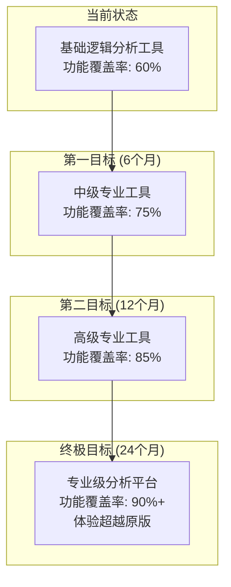
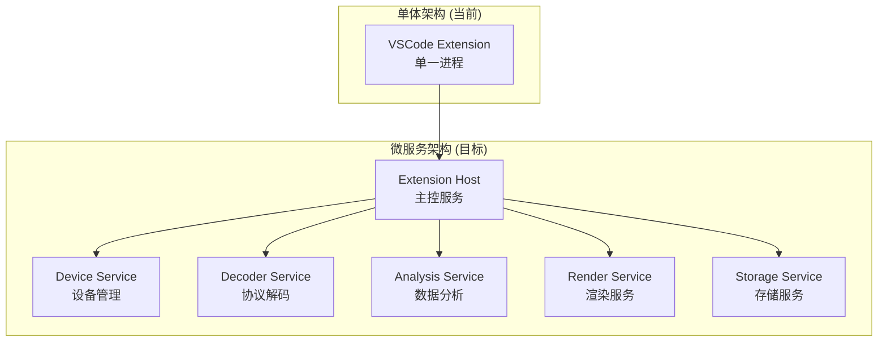

# 🚀 开发建议和路线图

[← 上一章：协议支持对比](./07-协议支持对比.md) | [返回目录](./README.md)

---

## 战略定位与目标

### 产品定位重新审视

基于详细对比分析，建议VSCode插件版采用**渐进式演进策略**，分阶段向专业级工具转型：



### 核心价值主张

重新定义VSCode插件版的独特优势：

1. **现代化开发体验**: 集成在开发者最熟悉的IDE中
2. **云端协作能力**: 支持团队共享分析结果和配置
3. **扩展生态集成**: 与其他VSCode插件无缝协作
4. **跨平台一致性**: 统一的用户体验，无平台差异
5. **自动化友好**: 支持CI/CD集成和自动化测试

## 开发路线图详细规划

### P0阶段：基础能力补强 (0-3个月)

#### 目标：提升核心功能完整度至75%

##### 关键任务清单

**硬件通信层优化** (2周)
- [ ] 完善设备发现机制，支持更多设备类型
- [ ] 实现自动重连和错误恢复机制
- [ ] 增强WiFi设备配置和管理功能
- [ ] 添加连接质量监控和诊断

**现有协议解码器增强** (4周)
```typescript
// I2C解码器增强计划
interface I2CEnhancementPlan {
  newFeatures: [
    '10位地址支持',           // +2天开发
    '时钟延展检测',           // +3天开发
    'SMBus协议层解析',        // +5天开发
    '多主机冲突检测',         // +4天开发
    '自动波特率检测'          // +3天开发
  ];

  qualityImprovements: [
    '边沿情况处理',           // +2天测试
    '错误恢复机制',           // +2天开发
    '性能优化',              // +3天开发
    '单元测试完善'            // +5天测试
  ];
}

// SPI解码器增强计划
interface SPIEnhancementPlan {
  criticalFeatures: [
    'SPI模式1-3支持',         // +3天开发
    '16/32位字长支持',        // +2天开发
    '多片选支持',            // +4天开发
    'Quad-SPI基础支持'        // +7天开发
  ];

  protocolLayers: [
    'SPI Flash命令解析',     // +5天开发
    'SD卡协议支持',          // +8天开发
    '自定义协议层框架'        // +6天开发
  ];
}

// UART解码器完整实现
interface UARTImplementationPlan {
  coreFeatures: [
    '基础帧格式解码',         // +4天开发
    '自动波特率检测',         // +6天开发
    '奇偶校验验证',           // +2天开发
    '帧错误检测'             // +3天开发
  ];

  advancedFeatures: [
    '流控制信号支持',         // +4天开发
    'RS485协议支持',         // +5天开发
    'AT命令解析',            // +3天开发
    'ASCII/HEX显示模式'       // +2天开发
  ];
}
```

**用户界面现代化** (3周)
- [ ] 实现响应式布局设计
- [ ] 添加暗色主题支持
- [ ] 优化波形渲染性能（目标：支持100万样本@60fps）
- [ ] 实现高级测量工具（频率、占空比、脉宽）
- [ ] 添加波形导航和书签功能

**测试和质量保证** (2周)
- [ ] 建立自动化测试框架
- [ ] 实现协议解码器单元测试（覆盖率>80%）
- [ ] 性能基准测试和回归测试
- [ ] 用户验收测试和反馈收集

##### P0阶段成功指标

| 指标类别 | 目标值 | 当前值 | 测量方法 |
|---------|-------|--------|---------|
| **功能覆盖率** | 75% | 60% | 功能检查清单 |
| **协议支持** | 6个协议 | 3个协议 | 协议数量统计 |
| **性能指标** | <2秒启动 | ~3秒 | 启动时间测量 |
| **用户满意度** | >4.2/5.0 | 待测量 | 用户调研 |
| **Bug密度** | <2个/KLOC | 待测量 | 代码审查 |

### P1阶段：专业功能扩展 (3-9个月)

#### 目标：实现关键协议支持，功能覆盖率达到85%

##### 关键协议实现计划

**CAN总线协议支持** (优先级🔥 - 4-6周)
```typescript
// CAN协议实现路线图
class CANImplementationRoadmap {
  phase1_BasicCAN = {
    duration: '2周',
    features: [
      '标准CAN 2.0A (11位ID)',
      '基础帧类型解码 (数据帧、远程帧)',
      '位填充检测',
      'CRC校验验证',
      '基础错误检测'
    ]
  };

  phase2_ExtendedCAN = {
    duration: '1周',
    features: [
      '扩展CAN 2.0B (29位ID)',
      '混合ID格式自动检测',
      '仲裁优先级分析'
    ]
  };

  phase3_AdvancedFeatures = {
    duration: '2-3周',
    features: [
      '错误帧详细分析',
      '过载帧支持',
      '总线负载统计',
      '消息过滤和搜索',
      '基础DBC数据库支持'
    ]
  };

  // 技术挑战分析
  technicalChallenges = {
    bitTiming: '精确的位时序分析 - 需要高精度采样',
    errorDetection: '复杂的错误检测逻辑',
    dbcIntegration: 'DBC文件解析和消息定义'
  };
}
```

**USB协议支持** (优先级🔥 - 6-8周)
```typescript
// USB协议实现计划
class USBImplementationPlan {
  phase1_LowFullSpeed = {
    duration: '3周',
    scope: 'USB 1.1 Low/Full Speed (1.5/12 Mbps)',
    features: [
      'NRZI编码解码',
      '位填充处理',
      '包类型识别 (TOKEN/DATA/HANDSHAKE)',
      '基础PID解码',
      'CRC5/CRC16校验'
    ]
  };

  phase2_ProtocolLayer = {
    duration: '2周',
    features: [
      'SETUP事务解析',
      '标准设备请求解码',
      '描述符解析',
      '端点跟踪'
    ]
  };

  phase3_AdvancedFeatures = {
    duration: '3周',
    features: [
      'USB 2.0 High Speed (480 Mbps)',
      '设备类特定协议',
      'HID报告解析',
      'CDC-ACM协议支持'
    ]
  };

  // 实现挑战
  implementationChallenges = {
    signalIntegrity: '高速信号需要精确时钟恢复',
    protocolComplexity: 'USB协议栈非常复杂',
    testEquipment: '需要各种USB设备进行测试验证'
  };
}
```

**以太网协议支持** (优先级🔥 - 5-7周)
```typescript
// 以太网协议实现规划
class EthernetImplementationPlan {
  phase1_PhysicalLayer = {
    duration: '2周',
    features: [
      '10BASE-T Manchester解码',
      '100BASE-TX 4B/5B + MLT-3',
      '前导码和SFD检测',
      '帧边界识别'
    ]
  };

  phase2_DataLinkLayer = {
    duration: '2周',
    features: [
      '以太网帧格式解析',
      'MAC地址解析',
      'EtherType/Length字段',
      'CRC32校验',
      'VLAN标签支持'
    ]
  };

  phase3_NetworkLayer = {
    duration: '2-3周',
    features: [
      'ARP协议解析',
      'IPv4/IPv6基础支持',
      'ICMP协议',
      'TCP/UDP端口解析'
    ]
  };
}
```

**工业协议支持** (3-4周)
- Modbus RTU/ASCII协议
- LIN总线协议
- 1-Wire协议
- PWM信号分析

##### 高级分析工具开发

**频谱分析工具** (2-3周)
```typescript
// FFT频谱分析器实现
class SpectrumAnalyzer {
  features = [
    'FFT快速傅里叶变换',
    '窗口函数支持 (Hamming, Blackman等)',
    '功率谱密度分析',
    '频率峰值检测',
    '谐波分析',
    '频谱瀑布图'
  ];

  // 技术实现
  implementation = {
    fftLibrary: 'ml-fft或自实现',
    webWorker: '后台计算避免UI阻塞',
    webgl: 'GPU加速频谱显示',
    streaming: '实时频谱分析'
  };
}
```

**信号质量分析** (3-4周)
```typescript
// 信号完整性分析工具
class SignalIntegrityAnalyzer {
  measurements = [
    '上升/下降时间测量',
    '过冲/下冲检测',
    '信噪比计算',
    '抖动分析 (RMS/P-P)',
    '眼图生成',
    '建立/保持时间验证'
  ];

  // 高级功能
  advancedFeatures = [
    '自动阈值检测',
    '信号质量评分',
    '时序违规报告',
    '信号完整性建议'
  ];
}
```

##### P1阶段里程碑

| 月份 | 主要交付物 | 成功标准 |
|------|-----------|---------|
| **月4** | CAN协议解码器 | 支持基础CAN 2.0A/B，通过汽车ECU测试 |
| **月5** | USB协议解码器 | 支持USB 1.1/2.0，通过标准设备测试 |
| **月6** | 以太网协议解码器 | 支持10/100M以太网，TCP/IP基础解析 |
| **月7** | 频谱分析工具 | FFT分析，支持10MHz信号分析 |
| **月8** | 工业协议包 | Modbus/LIN/1-Wire协议支持 |
| **月9** | 质量和性能优化 | 性能提升50%，bug修复，用户反馈整合 |

### P2阶段：高级功能和生态建设 (9-18个月)

#### 目标：建立专业级分析平台，超越原版体验

##### 高级硬件功能实现

**多设备级联系统** (6-8周)
```typescript
// 多设备级联架构设计
class MultiDeviceCascadeSystem {
  architecture = {
    deviceDiscovery: '自动发现可级联设备',
    clockSync: '硬件时钟同步机制',
    triggerChain: '级联触发链管理',
    dataAggregation: '多路数据流合并',
    syncVerification: '同步性验证和校准'
  };

  // 实现挑战
  challenges = {
    hardwareTiming: '纳秒级时序同步要求',
    dataVolume: '多设备数据流的实时处理',
    configuration: '复杂的级联配置管理',
    debugging: '多设备环境下的问题诊断'
  };

  // 技术方案
  technicalApproach = {
    masterSlave: '主从设备架构',
    timestamping: '硬件时间戳同步',
    bufferManagement: '分布式缓冲区管理',
    loadBalancing: '数据处理负载均衡'
  };
}
```

**信号生成器集成** (4-6周)
```typescript
// 信号生成器功能规划
class SignalGeneratorIntegration {
  // SDL信号描述语言编译器
  sdlCompiler = {
    lexer: 'SDL词法分析器',
    parser: 'SDL语法解析器',
    codeGen: '信号序列生成器',
    optimizer: '信号序列优化器'
  };

  // 支持的信号类型
  signalTypes = [
    'Clock signals',         // 时钟信号
    'Protocol sequences',    // 协议序列
    'Test vectors',         // 测试向量
    'Custom patterns',      // 自定义模式
    'Stress test signals'   // 压力测试信号
  ];

  // 高级特性
  advancedFeatures = [
    'Real-time signal generation',  // 实时信号生成
    'Synchronous capture/generate', // 同步采集生成
    'Loop-back testing',           // 回环测试
    'Protocol conformance test'     // 协议一致性测试
  ];
}
```

##### 数据分析和AI集成

**智能协议识别** (3-4周)
```typescript
// AI驱动的协议自动识别
class IntelligentProtocolDetection {
  // 机器学习模型
  mlModels = {
    signalClassifier: '信号特征分类器',
    protocolIdentifier: '协议模式识别器',
    parameterExtractor: '参数自动提取器',
    anomalyDetector: '异常检测模型'
  };

  // 训练数据集
  trainingData = {
    commonProtocols: 'I2C/SPI/UART/CAN等常见协议',
    industrialProtocols: 'Modbus/Profibus等工业协议',
    customProtocols: '用户自定义协议样本',
    noisePatterns: '各种噪声和干扰模式'
  };

  // 实现方案
  implementation = {
    framework: 'TensorFlow.js or ONNX.js',
    training: '离线训练 + 在线学习',
    inference: 'WebWorker中运行推理',
    feedback: '用户反馈改进模型'
  };
}
```

**自动化测试框架** (4-5周)
```typescript
// 协议一致性自动测试
class AutomatedTestFramework {
  testTypes = {
    conformanceTest: '协议一致性测试',
    stressTest: '压力和边界测试',
    interopTest: '互操作性测试',
    regressionTest: '回归测试',
    performanceTest: '性能基准测试'
  };

  // 测试用例生成
  testGeneration = {
    templateBased: '基于模板的测试生成',
    randomized: '随机化测试序列',
    mutation: '变异测试用例',
    boundary: '边界值测试'
  };

  // 结果分析
  resultAnalysis = {
    autoVerification: '自动结果验证',
    diffAnalysis: '差异分析报告',
    coverage: '测试覆盖率分析',
    reporting: '详细测试报告生成'
  };
}
```

##### 云端协作和集成

**团队协作功能** (3-4周)
```typescript
// 云端协作平台集成
class CloudCollaborationPlatform {
  // 核心功能
  coreFeatures = {
    projectSharing: '项目云端共享',
    realtimeCollab: '实时协作分析',
    versionControl: '分析结果版本控制',
    teamWorkspace: '团队工作空间',
    accessControl: '权限管理系统'
  };

  // 集成服务
  integrationServices = {
    github: 'GitHub集成 - 问题跟踪',
    jira: 'Jira集成 - 任务管理',
    slack: 'Slack集成 - 通知推送',
    teams: 'Microsoft Teams集成',
    webex: 'Webex集成 - 远程协作'
  };

  // 数据同步
  dataSynchronization = {
    incrementalSync: '增量数据同步',
    conflictResolution: '冲突解决机制',
    offline: '离线工作支持',
    encryption: '端到端加密'
  };
}
```

**CI/CD集成支持** (2-3周)
```typescript
// 持续集成/持续部署集成
class CICDIntegration {
  // 支持的CI/CD平台
  platforms = [
    'GitHub Actions',
    'GitLab CI',
    'Jenkins',
    'Azure DevOps',
    'CircleCI'
  ];

  // 集成功能
  features = {
    automatedTesting: '自动化硬件测试',
    protocolValidation: '协议一致性验证',
    performanceRegression: '性能回归检测',
    reportGeneration: '测试报告生成',
    artifactArchive: '测试结果归档'
  };

  // CLI工具
  cliTool = {
    commands: ['analyze', 'test', 'export', 'compare'],
    scripting: '脚本化分析流程',
    integration: 'CI/CD流水线集成',
    reporting: 'JSON/XML格式报告输出'
  };
}
```

### P3阶段：生态扩展和创新功能 (18-24个月)

#### 目标：建立开放生态，成为行业标准工具

##### 插件生态系统

**第三方解码器插件框架** (4-5周)
```typescript
// 解码器插件API设计
interface DecoderPluginAPI {
  // 插件注册接口
  registerDecoder(decoder: PluginDecoder): void;

  // 插件生命周期
  lifecycle: {
    install: (plugin: DecoderPlugin) => Promise<void>;
    activate: (plugin: DecoderPlugin) => Promise<void>;
    deactivate: (plugin: DecoderPlugin) => Promise<void>;
    uninstall: (plugin: DecoderPlugin) => Promise<void>;
  };

  // 插件市场集成
  marketplace: {
    search: (query: string) => Promise<PluginInfo[]>;
    install: (pluginId: string) => Promise<boolean>;
    update: (pluginId: string) => Promise<boolean>;
    review: (pluginId: string, rating: number) => Promise<void>;
  };
}

// 插件开发工具包
class PluginDevelopmentKit {
  // 脚手架工具
  scaffolding = {
    template: '解码器插件模板',
    generator: '代码生成器',
    testing: '测试框架',
    packaging: '打包工具'
  };

  // 开发者工具
  devTools = {
    debugger: '插件调试器',
    profiler: '性能分析器',
    simulator: '信号模拟器',
    validator: '插件验证器'
  };
}
```

##### 高级分析和可视化

**3D波形可视化** (3-4周)
```typescript
// 3D波形显示引擎
class Advanced3DVisualization {
  // 3D渲染功能
  rendering = {
    webgl2: 'WebGL 2.0 3D渲染',
    shaders: '自定义着色器程序',
    textures: '纹理映射支持',
    lighting: '动态光照效果',
    animation: '流畅的3D动画'
  };

  // 可视化类型
  visualizationTypes = [
    'Waterfall display',    // 瀑布图显示
    'Eye diagram 3D',       // 3D眼图
    'Constellation plot',   // 星座图
    'Phase space plot',     // 相空间图
    'Time-frequency plot'   // 时频图
  ];

  // 交互功能
  interactions = {
    rotation: '3D旋转控制',
    zooming: '缩放和平移',
    selection: '3D区域选择',
    measurement: '3D测量工具',
    annotation: '3D标注系统'
  };
}
```

**AI辅助调试** (5-6周)
```typescript
// AI驱动的调试助手
class AIDebuggingAssistant {
  // 智能分析功能
  intelligentAnalysis = {
    patternRecognition: '异常模式识别',
    rootCauseAnalysis: '根因分析',
    suggestedFixes: '修复建议生成',
    predictiveAnalysis: '预测性分析',
    knowledgeBase: '问题知识库'
  };

  // 自然语言接口
  nlpInterface = {
    queryProcessing: '自然语言查询处理',
    explanationGeneration: '结果解释生成',
    conversationalUI: '对话式用户界面',
    voiceControl: '语音控制支持',
    multilingual: '多语言支持'
  };

  // 学习和改进
  continuousLearning = {
    userFeedback: '用户反馈学习',
    caseDatabase: '案例数据库建设',
    modelUpdate: '模型在线更新',
    performanceTracking: '性能跟踪优化'
  };
}
```

## 技术架构演进规划

### 当前架构优化

#### 性能瓶颈解决方案

**WebGL渲染优化** (1-2周)
```typescript
// 高性能波形渲染引擎重构
class HighPerformanceWaveformRenderer {
  // GPU加速渲染
  gpuAcceleration = {
    vertexShaders: '顶点着色器优化',
    fragmentShaders: '片段着色器优化',
    bufferManagement: '缓冲区管理优化',
    batchRendering: '批量渲染',
    levelOfDetail: '细节层次优化'
  };

  // 内存优化
  memoryOptimization = {
    objectPooling: '对象池管理',
    memoryReuse: '内存复用策略',
    garbageCollection: '垃圾收集优化',
    dataCompression: '数据压缩',
    lazyLoading: '延迟加载'
  };

  // 渲染性能目标
  performanceTargets = {
    maxDataPoints: '10M 数据点',
    targetFrameRate: '60 FPS',
    memoryUsage: '<512MB',
    startupTime: '<1秒',
    zoomResponse: '<100ms'
  };
}
```

**数据处理管线重构** (2-3周)
```typescript
// 流式数据处理架构
class StreamingDataPipeline {
  // WebWorker并行处理
  workerManagement = {
    workerPool: 'Worker线程池',
    taskScheduling: '任务调度器',
    loadBalancing: '负载均衡',
    faultTolerance: '容错处理',
    resultAggregation: '结果聚合'
  };

  // 数据流优化
  streamOptimization = {
    chunkProcessing: '分块处理',
    pipelineParallel: '流水线并行',
    backpressureHandling: '背压处理',
    bufferManagement: '缓冲区管理',
    flowControl: '流量控制'
  };
}
```

### 架构现代化路线

#### 微服务化架构演进

**服务拆分策略** (P2阶段)


**服务间通信协议**
```typescript
// 服务间通信接口设计
interface ServiceCommunication {
  // 消息总线
  messageBus: {
    protocol: 'MessagePort API';
    routing: '智能路由';
    loadBalancing: '负载均衡';
    faultTolerance: '故障转移';
  };

  // 服务发现
  serviceDiscovery: {
    registration: '服务注册';
    healthCheck: '健康检查';
    loadMonitoring: '负载监控';
    autoScaling: '自动扩缩容';
  };
}
```

## 项目管理和团队建设

### 开发团队结构建议

#### 核心团队配置
```typescript
interface DevelopmentTeam {
  // 核心角色
  coreRoles: {
    projectLead: {
      count: 1,
      responsibilities: [
        '项目整体规划和协调',
        '技术架构决策',
        '团队管理和沟通'
      ]
    };

    seniorDeveloper: {
      count: 2,
      responsibilities: [
        '核心模块开发',
        '技术难点攻关',
        '代码审查和指导'
      ]
    };

    protocolSpecialist: {
      count: 2,
      responsibilities: [
        '协议解码器开发',
        '协议标准研究',
        '测试用例设计'
      ]
    };

    uiUxDeveloper: {
      count: 1,
      responsibilities: [
        '用户界面开发',
        '用户体验优化',
        '可视化组件开发'
      ]
    };

    qaEngineer: {
      count: 1,
      responsibilities: [
        '测试框架建设',
        '自动化测试',
        '质量保证'
      ]
    };
  };

  // 兼职顾问
  advisors: {
    hardwareExpert: '硬件和信号完整性专家';
    domainExpert: '逻辑分析仪领域专家';
    userExperience: '用户体验顾问';
  };
}
```

### 开发流程和规范

#### 敏捷开发流程
```typescript
// 开发流程规范
interface DevelopmentProcess {
  // Sprint规划
  sprintPlanning: {
    duration: '2周 Sprint',
    ceremonies: [
      'Sprint Planning (4小时)',
      'Daily Standup (15分钟)',
      'Sprint Review (2小时)',
      'Sprint Retrospective (1小时)'
    ]
  };

  // 代码质量标准
  codeQuality: {
    coverage: '单元测试覆盖率 > 80%',
    linting: 'ESLint + Prettier强制执行',
    review: '所有代码必须Code Review',
    documentation: 'TypeDoc文档覆盖率 > 90%'
  };

  // 发布流程
  releaseProcess: {
    versioning: '语义化版本控制',
    testing: '自动化测试 + 手工验收测试',
    deployment: '分阶段发布 (Alpha -> Beta -> Release)',
    rollback: '快速回滚机制'
  };
}
```

## 风险评估和缓解策略

### 技术风险

#### 高风险项评估

| 风险项 | 风险等级 | 影响 | 概率 | 缓解策略 |
|--------|---------|------|------|---------|
| **多设备级联技术难度** | 🔴 高 | 严重 | 中等 | 分阶段实现，先验证概念 |
| **复杂协议解码性能** | 🟡 中 | 中等 | 高 | WebWorker并行，渐进优化 |
| **WebGL兼容性问题** | 🟡 中 | 中等 | 中等 | Canvas2D降级方案 |
| **大数据量内存溢出** | 🟡 中 | 严重 | 低 | 流式处理，内存监控 |
| **第三方依赖安全性** | 🟢 低 | 中等 | 低 | 定期安全审计 |

#### 业务风险

| 风险项 | 风险等级 | 影响 | 概率 | 缓解策略 |
|--------|---------|------|------|---------|
| **用户需求变化** | 🟡 中 | 中等 | 中等 | 敏捷开发，快速响应 |
| **竞争对手技术突破** | 🟡 中 | 高 | 低 | 技术趋势跟踪 |
| **开源社区支持不足** | 🟢 低 | 高 | 低 | 社区建设投入 |
| **人员流失** | 🟡 中 | 中等 | 中等 | 知识文档化，人员备份 |

### 质量保证策略

#### 测试策略框架
```typescript
// 全面的测试策略
interface TestingStrategy {
  // 测试金字塔
  testPyramid: {
    unitTests: {
      coverage: '> 80%',
      tools: ['Jest', 'TypeScript'],
      focus: '单个函数/类测试'
    };

    integrationTests: {
      coverage: '核心流程100%',
      tools: ['Playwright', 'Custom'],
      focus: '模块间接口测试'
    };

    e2eTests: {
      coverage: '主要用户场景',
      tools: ['VSCode Extension Test'],
      focus: '端到端用户流程'
    };

    performanceTests: {
      tools: ['Custom Benchmarks'],
      metrics: ['内存使用', '渲染性能', '解码速度']
    };
  };

  // 专项测试
  specializedTesting: {
    protocolConformance: '协议一致性测试',
    hardwareCompatibility: '硬件兼容性测试',
    crossPlatform: '跨平台兼容测试',
    security: '安全性测试',
    accessibility: '可访问性测试'
  };
}
```

## 成功指标和评估框架

### 关键绩效指标 (KPI)

#### 产品指标
```typescript
interface ProductKPIs {
  // 功能完整性指标
  functionality: {
    protocolSupport: '协议支持数量',
    featureCompleteness: '功能完整度百分比',
    bugDensity: '每千行代码缺陷数',
    testCoverage: '测试覆盖率'
  };

  // 性能指标
  performance: {
    startupTime: '启动时间 < 2秒',
    renderingFPS: '渲染帧率 > 60fps',
    memoryUsage: '内存使用 < 512MB',
    decodingSpeed: '解码速度 > 10Mbps'
  };

  // 用户体验指标
  userExperience: {
    satisfactionScore: '用户满意度 > 4.2/5.0',
    taskCompletionRate: '任务完成率 > 90%',
    learningCurve: '新用户上手时间 < 30分钟',
    supportTickets: '支持工单数量趋势'
  };

  // 生态系统指标
  ecosystem: {
    activeUsers: '月活跃用户数',
    communityContributions: '社区贡献数量',
    thirdPartyPlugins: '第三方插件数量',
    starRating: 'VSCode市场评分'
  };
}
```

#### 技术债务管理
```typescript
interface TechnicalDebtManagement {
  // 债务分类
  debtCategories: {
    architecture: '架构债务 - 需要重构的设计',
    code: '代码债务 - 需要清理的代码',
    test: '测试债务 - 缺失的测试用例',
    documentation: '文档债务 - 缺失或过时的文档'
  };

  // 债务度量
  debtMetrics: {
    sonarQube: 'SonarQube技术债务评分',
    codeClimate: 'Code Climate维护性评级',
    customMetrics: '自定义债务指标'
  };

  // 偿还策略
  repaymentStrategy: {
    continuous: '持续小幅改进',
    dedicated: '专门的重构Sprint',
    opportunistic: '机会主义重构',
    planned: '计划性大重构'
  };
}
```

## 总结和行动建议

### 立即行动项 (本月内)

1. **团队建设** (1周内)
   - 确定核心开发团队成员
   - 建立开发环境和工具链
   - 制定编码规范和流程

2. **技术准备** (2周内)
   - 设置持续集成/持续部署流水线
   - 建立自动化测试框架
   - 完善现有代码的文档和测试

3. **需求确认** (1周内)
   - 进行用户调研，确认优先级
   - 制定详细的P0阶段计划
   - 建立用户反馈收集机制

### 中期准备工作 (下个月)

1. **架构重构准备**
   - 设计微服务化架构方案
   - 准备性能基准测试
   - 研究关键技术难点

2. **生态建设准备**
   - 设计插件开发框架
   - 建立社区协作平台
   - 制定开源贡献指南

### 长期战略执行

通过系统性的分阶段实施，VSCode插件版逻辑分析仪有望在24个月内：

- **功能覆盖率达到90%以上**，基本实现与原版功能对等
- **用户体验显著超越原版**，成为开发者首选工具
- **建立繁荣的插件生态**，吸引第三方开发者贡献
- **在专业领域获得认可**，成为行业标准工具

这一路线图为项目提供了清晰的发展方向和具体的实施路径，确保资源投入的最大化回报和用户价值的持续提升。

---

**本分析文档到此结束。通过系统性的对比分析，我们深入理解了VSCode插件版与原版逻辑分析仪的差异，并制定了切实可行的发展路线图。希望这份分析能为项目的未来发展提供有价值的参考和指导。**

---

[← 上一章：协议支持对比](./07-协议支持对比.md) | [返回目录](./README.md)