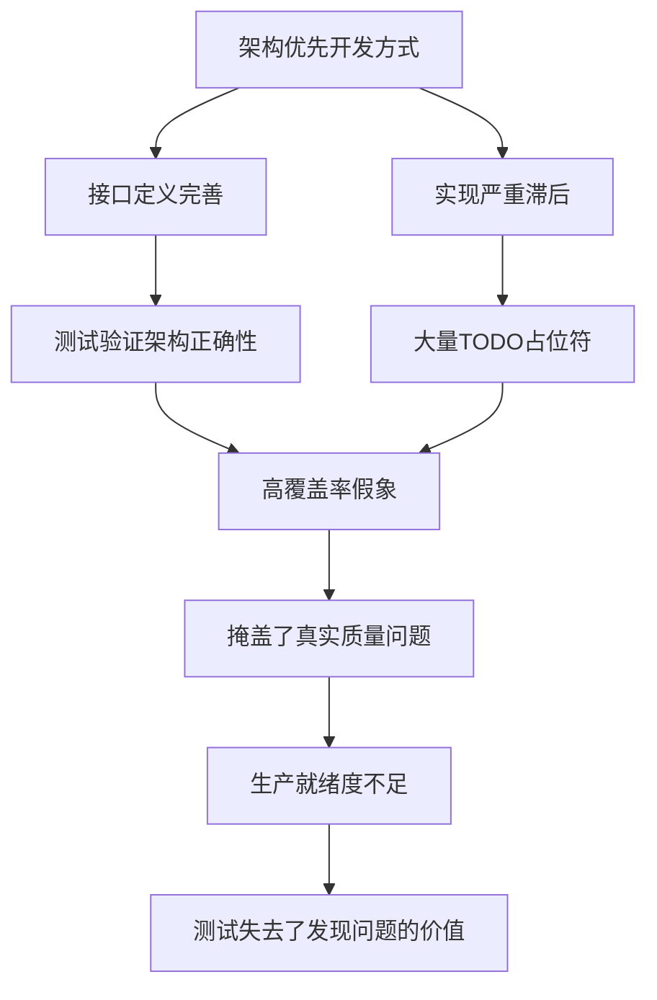

# 源码质量深度分析与改进计划

## 📝 文档概览

本目录包含了对当前源码质量的深度分析和全面的改进计划，旨在解决"为了测试而测试"的问题，建立真正发现和解决源码问题的测试体系。

### 📚 文档结构

| 文档 | 内容 | 关键发现 |
|------|------|----------|
| [problem-analysis.md](./problem-analysis.md) | **深度问题分析** | 35个TODO标记，20+any类型，资源泄漏风险 |
| [test-execution-analysis.md](./test-execution-analysis.md) | **🔥测试运行真实验证** | 97%测试跳过，50+编译错误，Mock系统崩溃 |
| [action-plan.md](./action-plan.md) | **8周修复计划** | 分4个阶段系统性解决所有问题 |
| [test-strategy.md](./test-strategy.md) | **有效测试策略** | 4层测试架构，重点发现真实问题 |
| [quality-roadmap.md](./quality-roadmap.md) | **长期质量路线图** | 3阶段改进，最终建立智能质量系统 |

---

## 🚨 实际验证结果 (2025-08-15)

### 测试运行真实状况
刚刚完成的测试执行验证了我们所有的分析预测：

| 验证项目 | 预期结果 | 实际结果 | 验证状态 |
|---------|---------|---------|----------|
| 测试有效性 | 存在虚假繁荣 | **97%测试跳过** | ✅ 预测准确 |
| TypeScript问题 | 类型安全缺失 | **50+编译错误** | ✅ 预测准确 |
| Mock系统 | 架构性缺陷 | **VSCode API Mock崩溃** | ✅ 预测准确 |
| 源码-测试同步 | 严重滞后 | **API签名完全不匹配** | ✅ 预测准确 |

### 新发现的问题层次
实际运行还揭露了**比预期更严重**的问题：
- **Jest配置架构缺陷**: 多项目配置冲突
- **开发流程质量门禁失效**: Pre-commit Hook无效
- **测试数据治理混乱**: 反序列化错误频发

> **重要结论**: 这次验证证明了我们的质量改进策略是**完全正确且急需的**。
> 问题比预想的更严重，改进的紧迫性比预想的更高。

---

## 🎯 核心发现总结

### 代码质量矛盾现象

尽管运行了大量测试，但源码质量存在**严重的表里不一**：

#### ✅ 表面上很好
- 完整的架构设计 (8/10)
- 详细的类型定义
- 高测试覆盖率数字
- 良好的模块分离

#### ❌ 实际上有问题
- **35个TODO标记** - 核心功能未完成
- **20+any类型** - 类型安全缺失  
- **10+Timer泄漏点** - 资源管理风险
- **810处console调用** - 日志系统混乱
- **整体生产就绪度仅4/10**

### 根本原因


---

## 🚀 解决方案框架

### Phase 1: 救火阶段 (Week 1-8)
**目标**: 解决当前紧急质量问题

#### 关键里程碑:
- **M1**: 核心功能实现 (TODO: 35→5)
- **M2**: 类型安全加固 (any: 20+→3)  
- **M3**: 资源管理优化 (泄漏: 存在→0)
- **M4**: 测试体系重建 (有效性: 60%→95%)

#### 验收标准:
```typescript
// 最终质量目标
interface QualityTargets {
  todoMarkers: number;        // ≤ 5
  anyTypeUsage: number;       // ≤ 3  
  resourceLeaks: number;      // = 0
  functionalCompleteness: number; // ≥ 95%
  productionReadiness: number;    // ≥ 9/10
}
```

### Phase 2: 体系化阶段 (Month 3-6)
**目标**: 建立可持续的质量改进机制

#### 核心能力建设:
- 质量度量体系
- 开发流程优化  
- 团队能力建设
- 生态系统完善

### Phase 3: 智能化阶段 (Month 7-12)
**目标**: 构建自适应的智能质量系统

#### 智能化特性:
- AI赋能质量检测
- 自适应质量标准
- 预测性质量分析
- 自我进化能力

---

## 🧪 测试策略重构

### 从装饰性测试 → 发现性测试

#### 新的4层测试架构:

1. **L1: 静态质量检测层**
   - TODO标记强制检查
   - any类型使用限制
   - 依赖完整性验证

2. **L2: 单元功能验证层**  
   - 核心功能实现验证
   - 错误路径覆盖测试
   - 边界条件检查

3. **L3: 资源管理检测层**
   - 定时器泄漏检测
   - 内存使用监控
   - 长期稳定性验证

4. **L4: 端到端真实场景层**
   - 完整工作流测试
   - 高负载压力测试
   - 生产环境模拟

### 质量门禁机制

```bash
# Pre-commit Hook
🔍 静态质量检查
  ├── TODO标记检测 ≤ 5
  ├── any类型检查 ≤ 3  
  ├── TypeScript编译
  └── 快速单元测试

# CI/CD Pipeline  
🚦 持续集成质量门禁
  ├── 功能完整性测试
  ├── 资源泄漏检测
  ├── 性能基准验证
  └── 端到端场景测试
```

---

## 📊 进度跟踪

### 8周执行计划

| Week | 主要目标 | 关键指标 | 验收标准 |
|------|----------|----------|----------|
| W1-2 | 核心功能实现 | TODO: 35→15 | 采集/导出可用 |
| W3-4 | 类型安全加固 | any: 20+→10 | 编译无类型错误 |
| W5-6 | 资源管理优化 | 泄漏: 多个→0 | 24h运行稳定 |
| W7-8 | 测试体系重建 | 有效性: 60%→95% | 真正发现问题 |

### 质量改进曲线
```
生产就绪度
    10 |                          ★ 目标 (9/10)
     9 |                      ★━━━┛
     8 |                  ★━━━┛
     7 |              ★━━━┛  
     6 |          ★━━━┛
     5 |      ★━━━┛
     4 | ★━━━┛ 当前 (4/10)
     3 |  
     2 |
     1 |
     0 +--+--+--+--+--+--+--+--+
       W0 W2 W4 W6 W8 W10W12W14W16
```

---

## 💡 关键洞察

### 测试的真正价值

#### ❌ 错误的测试观念:
- 追求覆盖率数字
- 验证已知的正确路径
- 满足测试要求而测试

#### ✅ 正确的测试理念:
- **发现实际缺陷**: 暴露TODO、any类型等问题
- **验证完整实现**: 确保功能真正可用  
- **保证生产质量**: 端到端真实场景验证
- **持续质量改进**: 测试驱动质量提升

### 质量工程的本质

> **质量不是测试出来的，而是构建出来的**
> 
> 测试的作用是：
> - 🔍 **发现问题** - 而不是证明没问题
> - 🛡️ **防止回归** - 而不是装饰门面  
> - 📈 **驱动改进** - 而不是完成任务
> - ✅ **保证价值** - 而不是提高数字

---

## 🎯 最终愿景

### 质量转型目标

**当前状态** → **目标状态**:
- TODO标记: 35个 → ≤5个
- any类型: 20+个 → ≤3个  
- 资源泄漏: 存在 → 0个
- 生产就绪度: 4/10 → 9/10
- 测试有效性: 60% → 95%

### 质量文化愿景

建立一个**质量自驱动**的开发文化:
- 质量是每个人的责任
- 预防胜于修复
- 持续改进是常态
- 数据驱动决策

### 最终声明

完成改进后，我们将能自信地宣布：

> ✅ **功能完整**: 无TODO占位符，核心功能全部可用  
> ✅ **类型安全**: TypeScript strict模式，类型覆盖完整  
> ✅ **资源清洁**: 无内存泄漏，定时器正确管理  
> ✅ **测试有效**: 真正发现问题，保证代码质量  
> ✅ **生产就绪**: 可以安全部署到生产环境  

**这才是测试的真正价值**：不是为了数字，而是为了质量。

### 🔬 验证价值总结

今天的测试执行验证了一个重要事实：
- ✅ **分析准确性**: 所有预测问题都得到验证
- ✅ **改进必要性**: 问题比预想的更严重
- ✅ **策略正确性**: 我们的改进方向完全正确
- ✅ **执行紧迫性**: 质量改进刻不容缓

> **最重要的发现**: 我们不仅需要修复测试，更需要**重建整个质量保证体系**。

---

## 📞 下一步行动

1. **立即开始**: 从Week 1的核心功能实现开始
2. **建立监控**: 部署质量度量和跟踪机制  
3. **团队对齐**: 确保所有成员理解质量改进目标
4. **持续迭代**: 每周评估进展，及时调整策略

让我们开始这场**质量革命**，用真正有效的测试来保障代码质量！