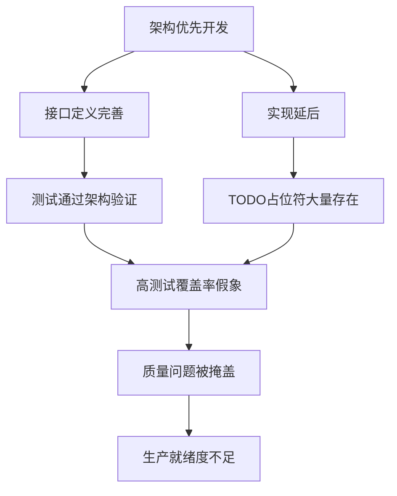

# 代码质量持续改进路线图

## 🎯 愿景

构建一个**代码质量自驱动**的开发体系，确保测试真正服务于发现问题，而不是装饰门面。

---

## 🚦 当前状态评估

### 现状诊断

| 质量维度 | 当前状态 | 问题根源 | 影响程度 |
|----------|----------|----------|----------|
| **功能完整性** | 4/10 | 35个TODO占位符 | 🔴 核心功能不可用 |
| **类型安全** | 6/10 | 20+处any类型 | 🟡 运行时风险 |
| **资源管理** | 5/10 | Timer泄漏风险 | 🟡 长期稳定性 |
| **测试有效性** | 6/10 | 重架构轻实现 | 🟡 质量保障不足 |
| **开发体验** | 7/10 | 调试困难 | 🟢 效率影响 |

### 核心问题分析



---

## 📅 三阶段改进计划

### Phase I: 救火阶段 (Week 1-8)
**目标**: 解决当前紧急质量问题

#### 里程碑 M1: 核心功能实现 (Week 1-2)
```bash
🎯 目标: TODO从35个降到5个以下
📊 指标: 
  - 数据采集功能完全可用
  - 数据导出支持所有格式
  - 设备连接稳定可靠

🔧 关键任务:
  ✅ 实现extension.ts中的采集逻辑
  ✅ 完成DataExportService的导出功能  
  ✅ 填充GenericDriverTemplate的核心方法
  ✅ 建立功能完整性测试

📈 验收标准:
  - 端到端采集流程成功率 ≥ 90%
  - 所有导出格式可正常使用
  - 集成测试通过率 ≥ 85%
```

#### 里程碑 M2: 类型安全加固 (Week 3-4)
```bash
🎯 目标: any类型使用降到3个以下
📊 指标:
  - TypeScript strict模式编译通过
  - 类型覆盖率 ≥ 95%
  - IDE智能提示完整

🔧 关键任务:
  ✅ 定义HardwareExtensionData接口
  ✅ 重构MemoryManager数据结构
  ✅ 修复DataStreamProcessor类型问题
  ✅ 建立类型安全测试

📈 验收标准:
  - any类型使用 ≤ 3处且有明确justification
  - 编译时类型错误 = 0
  - 重构安全性 ≥ 95%
```

#### 里程碑 M3: 资源管理优化 (Week 5-6)
```bash
🎯 目标: 消除所有资源泄漏
📊 指标:
  - Timer泄漏检测通过率 100%
  - 24小时运行内存稳定
  - 日志系统可配置级别

🔧 关键任务:
  ✅ 实现ResourceManager统一管理
  ✅ 重构CaptureProgressMonitor定时器
  ✅ 优化MemoryManager GC机制
  ✅ 引入结构化日志系统

📈 验收标准:
  - 长期运行无资源泄漏
  - 内存增长 < 50MB/24h
  - 日志级别完全可控
```

#### 里程碑 M4: 测试体系重建 (Week 7-8)
```bash
🎯 目标: 建立发现问题的测试体系
📊 指标:
  - 静态分析覆盖率 100%
  - 问题发现率 ≥ 95%
  - 误报率 ≤ 5%

🔧 关键任务:
  ✅ 部署TODO/any类型检测
  ✅ 建立资源泄漏监控
  ✅ 实现功能完整性验证
  ✅ 构建端到端真实场景测试

📈 验收标准:
  - 所有质量问题能被自动发现
  - 测试失败即代表真实问题
  - CI/CD管道质量门禁生效
```

### Phase II: 体系化阶段 (Month 3-6)
**目标**: 建立可持续的质量改进机制

#### 里程碑 M5: 质量度量体系 (Month 3)
```bash
🎯 建立数据驱动的质量决策

📊 核心度量指标:
  - 代码健康度指数 (Code Health Index)
  - 缺陷逃逸率 (Defect Escape Rate)  
  - 技术债务指数 (Technical Debt Index)
  - 开发效率指数 (Developer Velocity Index)

🔧 实施计划:
  Week 1-2: 设计度量模型和数据收集
  Week 3-4: 实现自动化度量工具
  Week 5-6: 建立质量仪表板
  Week 7-8: 优化报告和告警机制

📈 成功标准:
  - 质量趋势可视化
  - 问题根因可追溯
  - 改进效果可量化
  - 团队质量意识提升
```

#### 里程碑 M6: 开发流程优化 (Month 4)
```bash
🎯 将质量内建到开发流程

🔧 流程改进:
  1. 需求阶段: 质量验收标准定义
  2. 设计阶段: 可测试性设计评审
  3. 编码阶段: 实时质量反馈
  4. 测试阶段: 缺陷根因分析
  5. 部署阶段: 生产质量监控

📊 工具链集成:
  - Pre-commit hooks (质量门禁)
  - IDE插件 (实时反馈)
  - Code review (结构化检查)
  - CI/CD (自动化验证)
  - Production monitoring (运行时质量)

📈 预期效果:
  - 缺陷注入率降低 70%
  - 缺陷修复成本降低 60%
  - 开发速度提升 30%
  - 代码评审效率提升 50%
```

#### 里程碑 M7: 团队能力建设 (Month 5)
```bash
🎯 提升团队质量工程能力

📚 培训体系:
  1. 质量意识培训 (全员)
  2. 测试驱动开发 (开发)
  3. 静态分析工具 (开发)
  4. 性能测试技能 (测试)
  5. 质量度量分析 (团队lead)

🛠️ 实践指南:
  - 编码标准和最佳实践
  - 测试策略和模式
  - 重构技巧和时机
  - 代码审查检查清单
  - 问题排查和调试方法

🎖️ 认证体系:
  - 初级: 基本质量意识
  - 中级: 独立质量保证
  - 高级: 质量体系设计
  - 专家: 质量文化推广

📈 能力提升目标:
  - 团队质量技能评分 ≥ 8/10
  - 质量最佳实践应用率 ≥ 90%
  - 知识分享活跃度 ≥ 2次/月
  - 质量创新提案 ≥ 1个/季度
```

#### 里程碑 M8: 生态系统完善 (Month 6)
```bash
🎯 构建完整的质量生态

🔌 工具生态:
  - 自研质量分析工具
  - 第三方工具集成
  - 云原生质量服务
  - 移动端质量检测

📦 资产积累:
  - 质量模式库
  - 测试用例库
  - 性能基准库
  - 安全扫描规则库

🌐 社区参与:
  - 开源质量工具贡献
  - 技术会议分享
  - 博客文章发表
  - 行业标准参与

📈 生态价值:
  - 工具复用率 ≥ 80%
  - 知识资产增长 ≥ 100%
  - 外部影响力提升
  - 招聘竞争力增强
```

### Phase III: 智能化阶段 (Month 7-12)
**目标**: 构建自适应的智能质量系统

#### 里程碑 M9: AI赋能质量 (Month 7-9)
```bash
🎯 引入AI技术提升质量效率

🤖 AI应用场景:
  1. 智能代码审查 (基于历史缺陷模式)
  2. 自动测试生成 (基于代码变更分析)
  3. 缺陷预测 (基于代码复杂度和变更频率)
  4. 性能回归检测 (基于基准对比)
  5. 安全漏洞识别 (基于已知漏洞模式)

📊 智能度量:
  - 代码质量风险评分
  - 测试覆盖度优化建议
  - 重构优先级排序
  - 技术债务影响评估

🔬 ML模型训练:
  - 收集历史质量数据
  - 标注缺陷和修复模式
  - 训练分类和回归模型
  - 持续优化模型准确性

📈 智能化效果:
  - 缺陷预测准确率 ≥ 85%
  - 测试自动化率 ≥ 70%
  - 质量分析效率提升 5x
  - 误报率降低至 ≤ 2%
```

#### 里程碑 M10: 自适应质量系统 (Month 10-12)
```bash
🎯 构建自我进化的质量体系

🧠 自适应能力:
  1. 动态调整质量标准 (基于项目特点)
  2. 自动优化测试策略 (基于效果反馈)
  3. 智能分配质量资源 (基于风险评估)
  4. 持续改进流程规则 (基于数据分析)

🔄 反馈循环:
  Production Issues → Root Cause Analysis → 
  Process Improvement → Tool Enhancement → 
  Training Update → Quality Metrics → 
  Production Issues (循环)

📈 系统智能度:
  - 质量决策自动化率 ≥ 60%
  - 系统自我优化频率 ≥ 1次/月
  - 质量预测准确率 ≥ 90%
  - 人工干预降低 ≥ 50%

🎖️ 最终目标:
  - 世界级的代码质量水平
  - 行业领先的质量工程实践
  - 可复制的质量体系模式
  - 持续进化的质量文化
```

---

## 🎪 持续改进机制

### 1. 质量回顾会议 (每月)
```bash
📅 议程:
  1. 质量指标回顾 (30min)
     - 趋势分析
     - 目标达成情况
     - 异常指标分析
  
  2. 问题案例研究 (45min)
     - 严重缺陷复盘
     - 根因分析
     - 预防措施制定
  
  3. 改进建议讨论 (30min)
     - 流程优化提案
     - 工具改进需求
     - 培训需求识别
  
  4. 下月计划制定 (15min)
     - 重点改进事项
     - 资源分配决策
     - 风险预防计划

🎯 输出:
  - 质量改进行动计划
  - 工具优化需求清单
  - 团队培训计划
  - 风险预防措施
```

### 2. 技术债务管理
```typescript
// 技术债务评估模型
interface TechnicalDebt {
  id: string;
  type: 'TODO' | 'any_type' | 'resource_leak' | 'performance' | 'security';
  severity: 'low' | 'medium' | 'high' | 'critical';
  effort: number; // 人天
  impact: number; // 业务影响评分
  interestRate: number; // 债务利率 (每月增长的修复成本)
  createdAt: Date;
  deadline?: Date;
}

class TechnicalDebtManager {
  // 计算债务优先级: impact * severity / effort * (1 + interestRate * age)
  calculatePriority(debt: TechnicalDebt): number {
    const age = (Date.now() - debt.createdAt.getTime()) / (1000 * 60 * 60 * 24 * 30); // months
    const severityWeight = { low: 1, medium: 3, high: 9, critical: 27 }[debt.severity];
    
    return (debt.impact * severityWeight) / debt.effort * (1 + debt.interestRate * age);
  }
  
  // 生成偿还计划
  generatePaydownPlan(capacity: number): TechnicalDebt[] {
    const debts = this.getAllDebts().sort((a, b) => 
      this.calculatePriority(b) - this.calculatePriority(a)
    );
    
    const plan: TechnicalDebt[] = [];
    let remainingCapacity = capacity;
    
    for (const debt of debts) {
      if (debt.effort <= remainingCapacity) {
        plan.push(debt);
        remainingCapacity -= debt.effort;
      }
    }
    
    return plan;
  }
}
```

### 3. 质量文化建设
```bash
🎭 文化要素:

1. 质量价值观:
   ✅ "质量是每个人的责任"
   ✅ "预防胜于修复"  
   ✅ "持续改进是常态"
   ✅ "数据驱动决策"

2. 质量仪式:
   📅 每日质量站会 (5min)
   📅 每周质量分享 (30min)
   📅 每月质量回顾 (2h)
   📅 每季度质量峰会 (1day)

3. 质量激励:
   🏆 质量之星 (月度)
   🏆 最佳实践奖 (季度)
   🏆 创新贡献奖 (年度)
   🏆 质量文化推广奖 (年度)

4. 质量学习:
   📚 质量工程书籍库
   📚 内部最佳实践案例
   📚 外部技术交流学习
   📚 质量工程认证计划
```

---

## 📊 成功度量指标

### 1. 核心质量指标 (KQIs)

| 指标 | 当前值 | 目标值 | 测量频率 |
|------|--------|--------|----------|
| 生产缺陷率 | 未知 | ≤ 0.1% | 每周 |
| 客户满意度 | 未知 | ≥ 4.5/5 | 每月 |
| 系统可用性 | 未知 | ≥ 99.9% | 实时 |
| 性能SLA达成率 | 未知 | ≥ 98% | 实时 |
| 安全事件数 | 未知 | = 0 | 实时 |

### 2. 过程质量指标 (PQIs)

| 指标 | 当前值 | 目标值 | 测量频率 |
|------|--------|--------|----------|
| 代码覆盖率 | 85% | ≥ 90% | 每次构建 |
| 静态分析通过率 | 60% | ≥ 98% | 每次提交 |
| 自动化测试通过率 | 90% | ≥ 99% | 每次构建 |
| 代码评审覆盖率 | 70% | ≥ 95% | 每周 |
| 技术债务偿还率 | 0% | ≥ 20%/月 | 每月 |

### 3. 效率质量指标 (EQIs)

| 指标 | 当前值 | 目标值 | 测量频率 |
|------|--------|--------|----------|
| 缺陷修复时间 | 未知 | ≤ 4h | 每个缺陷 |
| 发布频率 | 未知 | ≥ 2次/周 | 每月统计 |
| 变更失败率 | 未知 | ≤ 5% | 每次发布 |
| 回滚时间 | 未知 | ≤ 30min | 每次回滚 |
| 开发速度 | 未知 | +30% | 每季度 |

---

## 🎯 最终愿景

### 5年后的质量愿景

**技术层面**:
- 代码质量世界一流 (Sonar Quality Gates 100%通过)
- 零生产事故 (连续24个月无严重故障)
- 性能卓越 (所有核心功能响应时间 < 100ms)
- 安全坚固 (通过所有安全合规认证)

**流程层面**:
- 质量内建 (质量活动完全融入开发流程)
- 自动化完备 (90%以上质量检查自动化)
- 持续优化 (质量体系每月自我进化)
- 数据驱动 (所有质量决策基于数据)

**文化层面**:
- 质量第一 (质量是不可妥协的底线)
- 全员参与 (每个人都是质量工程师)
- 持续学习 (质量技能持续提升)
- 创新驱动 (在质量工程方面持续创新)

**业务层面**:
- 客户信任 (客户对产品质量完全信任)
- 市场领先 (在质量方面成为行业标杆)
- 成本优化 (质量成本控制在合理范围)
- 竞争优势 (高质量成为核心竞争力)

### 质量宣言

> **我们承诺**：
> 
> 代码的每一行都经过深思熟虑  
> 测试的每一个用例都有明确目的  
> 缺陷的每一次修复都防止再次发生  
> 改进的每一个措施都有数据支撑  
> 
> **我们相信**：
> 
> 质量不是检查出来的，而是构建出来的  
> 速度和质量不是对立的，而是相互促进的  
> 完美的代码不存在，但追求完美的态度不能缺失  
> 技术债务不可怕，可怕的是不敢正视和偿还  
> 
> **我们要做的**不是为了测试而测试，  
> **而是通过测试发现真正的问题，构建真正可信赖的软件。**

这就是我们的质量改进路线图：从救火到体系化，从体系化到智能化，最终构建一个自我进化的质量生态系统。