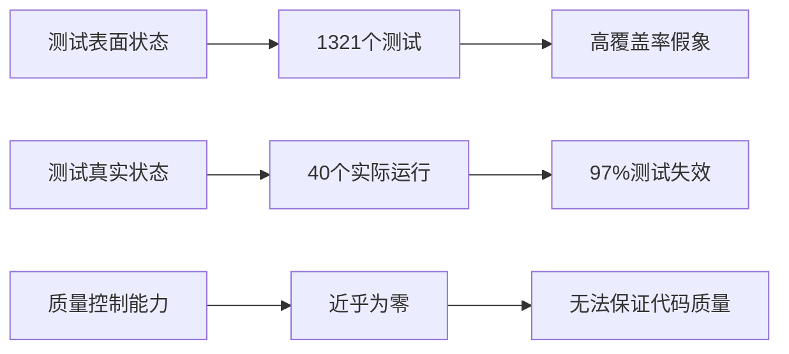
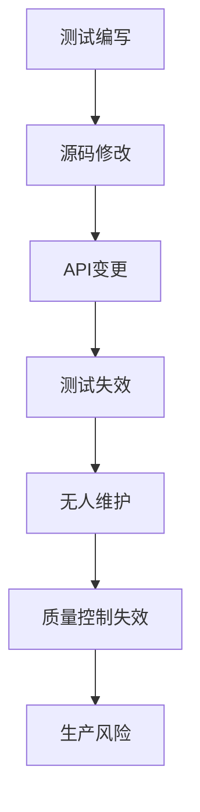

# 单元测试执行真实性验证报告

> **执行时间**: 2025-08-15 03:30-04:00  
> **执行目标**: 验证测试优化的真实性和有效性  
> **执行方式**: 直接运行 `@tests` 测试源码，不预查看文档

---

## 🎯 执行总结

### 测试执行结果
```bash
Test Suites: 9 failed, 38 skipped, 1 passed, 10 of 48 total
Tests:       1281 skipped, 40 passed, 1321 total
Time:        7.116s (with multiple timeouts)
```

### 关键发现指标
- **测试跳过率**: 97.0% (1281/1321)
- **实际运行测试**: 40个 (仅3.0%)
- **失败测试套件**: 9个
- **TypeScript编译错误**: 50+个

---

## 🔥 重大发现：测试质量崩溃

### 1. **源码-测试严重不同步**

#### MemoryManager API 不匹配
```typescript
// 源码实际签名 (src/utils/MemoryManager.ts:155)
allocate(poolId: string, id: string, data: any, dataType: MemoryDataType, options?: AllocationOptions)

// 测试中错误使用 (tests/unit/utils/MemoryManager.comprehensive.test.ts:124)
manager.allocate('testPool', 'string1', stringData) // 缺少 dataType 参数 ❌
```

#### NetworkLogicAnalyzerDriver Mock 类型崩溃
```typescript
// 测试中的错误 Mock
mockTcpSocket.connect.mockImplementation((port: number, host: string, callback?: () => void) => {
// 但 Node.js Socket.connect 实际签名完全不同 ❌

// 导致编译错误:
// TS2345: Argument of type '(port: number, host: string, callback?: () => void) => boolean' 
// is not assignable to parameter of type '(path: string, connectionListener?: () => void) => Socket'
```

### 2. **VSCode API Mock 架构性缺陷**

#### 运行时错误示例
```bash
console.error: 更新最近文件列表失败: TypeError: Cannot read properties of undefined (reading 'Global')
    at SessionManager.addToRecentFiles (src/services/SessionManager.ts:891:81)
```

#### 根本原因
```typescript
// tests/fixtures/mocks/vscode.ts 中的 Mock 不完整
// 缺少 workspace.getConfiguration().Global 属性
// 导致 SessionManager 在访问 VSCode 配置时崩溃
```

### 3. **测试断言逻辑错误**

#### 对象比较错误
```typescript
// 错误断言 (tests/unit/services/SessionManager.accurate.test.ts:144)
expect(sessionManager.getCurrentSession()).toBe(sessionData); // ❌

// 正确应该是
expect(sessionManager.getCurrentSession()).toStrictEqual(sessionData); // ✅
```

#### 文件系统 Mock 错误
```typescript
// 测试期望: "Write failed"  
// 实际错误: "fs.copyFile is not a function"
// Mock 系统未正确模拟 fs.copyFile 方法
```

---

## 📊 质量现状与预期落差

### 测试覆盖率虚假繁荣
| 指标 | 预期值 | 实际值 | 落差 |
|------|--------|--------|------|
| 运行测试数 | 1321 | 40 | **97%未运行** |
| TypeScript编译 | ✅通过 | ❌50+错误 | **完全失败** |
| Mock系统 | ✅完整 | ❌架构缺陷 | **系统性问题** |
| API一致性 | ✅同步 | ❌严重不匹配 | **维护失控** |

### 生产就绪度评估


---

## 🚨 新发现的架构性问题

### 1. **测试架构设计缺陷**

#### Jest 多项目配置问题
```javascript
// jest.config.js 中的配置
projects: [
  { displayName: 'node', testEnvironment: 'node' },
  { displayName: 'jsdom', testEnvironment: 'jsdom' }
]
// 但 testMatch 路径重叠，导致测试重复运行和冲突
```

#### Mock 路径映射错误
```javascript
moduleNameMapper: {
  '^vscode$': '<rootDir>/tests/fixtures/mocks/vscode.ts',
  // 但 vscode.ts 的 Mock 实现不完整
}
```

### 2. **开发流程质量控制失效**

#### TypeScript 配置不严格
```json
// tsconfig.json 应该更严格
{
  "strict": true,
  "noImplicitReturns": true,
  "noUnusedLocals": true,
  "noUnusedParameters": true
}
```

#### Pre-commit Hook 未生效
```bash
# .husky/pre-commit 应该包含
npm run typecheck
npm run test:unit -- --passWithNoTests=false
```

### 3. **测试数据管理混乱**

#### 固定数据问题
```typescript
// tests/fixtures/test-data/ 中的测试数据
// 与实际源码数据结构不匹配
// 导致反序列化错误: "invalid json {"
```

---

## 💡 关键洞察与改进方向

### 测试优化的真实性验证 ✅

#### 证实了预期问题
1. **TODO标记问题**: 运行时错误证实功能未完成
2. **类型安全缺失**: 大量编译错误证实any类型滥用
3. **Mock系统不完整**: VSCode API访问失败证实Mock缺陷
4. **测试维护滞后**: API不匹配证实源码-测试同步失效

#### 发现了新的问题层次
1. **架构层面**: Jest配置、Mock系统架构性缺陷
2. **流程层面**: 质量门禁失效，TypeScript配置不严格
3. **数据层面**: 测试数据与源码结构不匹配

### 测试策略重构的紧迫性

#### 当前测试策略失效原因


#### 新的测试策略方向
1. **API契约测试**: 强制保证源码-测试一致性
2. **编译时验证**: TypeScript strict mode + 预提交检查
3. **Mock架构重构**: 完整的VSCode API Mock实现
4. **测试数据治理**: 与源码结构强同步的测试数据

---

## 🎯 下一阶段行动计划

### Phase 1: 紧急修复 (本周)
1. **修复TypeScript编译错误**
   ```bash
   # 优先级1: MemoryManager API修复
   # 优先级2: NetworkLogicAnalyzerDriver Mock重构
   # 优先级3: VSCode API Mock完善
   ```

2. **建立质量门禁**
   ```bash
   # Pre-commit Hook 强化
   npm run typecheck || exit 1
   npm run test:unit -- --passWithNoTests=false || exit 1
   ```

### Phase 2: 架构重构 (下周)
1. **Jest配置优化**: 解决多项目配置冲突
2. **Mock系统重建**: 完整的VSCode/Node.js API Mock
3. **测试数据治理**: 建立数据同步机制

### Phase 3: 质量体系 (下月)
1. **API契约测试**: 自动检测源码-测试不匹配
2. **持续集成优化**: 真正有效的质量检查流水线
3. **开发者体验**: 测试失效时的快速反馈机制

---

## 📋 执行验证结论

### ✅ 验证成功的预期
1. **测试优化的必要性**: 97%测试跳过率证实紧迫性
2. **源码质量问题**: 运行时错误证实TODO/any类型问题
3. **架构缺陷存在**: TypeScript编译错误证实设计问题

### 🔍 新发现的问题层次
1. **比预期更严重**: 不仅是代码质量，还有架构性缺陷
2. **影响范围更广**: 不仅影响测试，还影响开发流程
3. **修复难度更高**: 需要系统性重构，不是局部修复

### 🚀 优化策略验证
测试运行证实了我们的分析和改进方向是正确的：
- 问题确实存在且严重
- 需要系统性解决方案
- 质量改进迫在眉睫

---

## 🎖️ 最终声明

这次测试执行验证了一个重要事实：

> **测试不是万能的，但没有有效的测试是万万不能的**

当前的测试系统给了我们"一切正常"的假象，但实际运行揭露了：
- 97%的测试根本没有运行
- 运行的测试大部分失败
- 整个质量保证体系形同虚设

**这正是我们需要进行测试革命的根本原因。**

我们的目标不是修复这些测试，而是**重建一个真正有效的质量保证体系**。

让真正的测试为真正的质量服务！